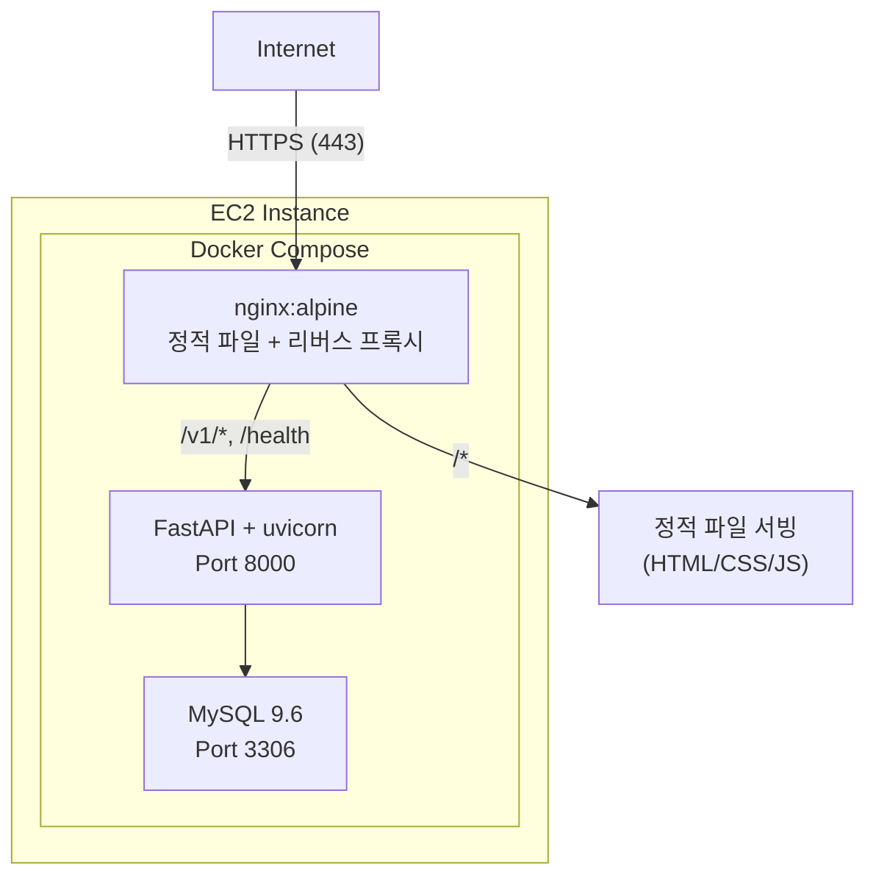
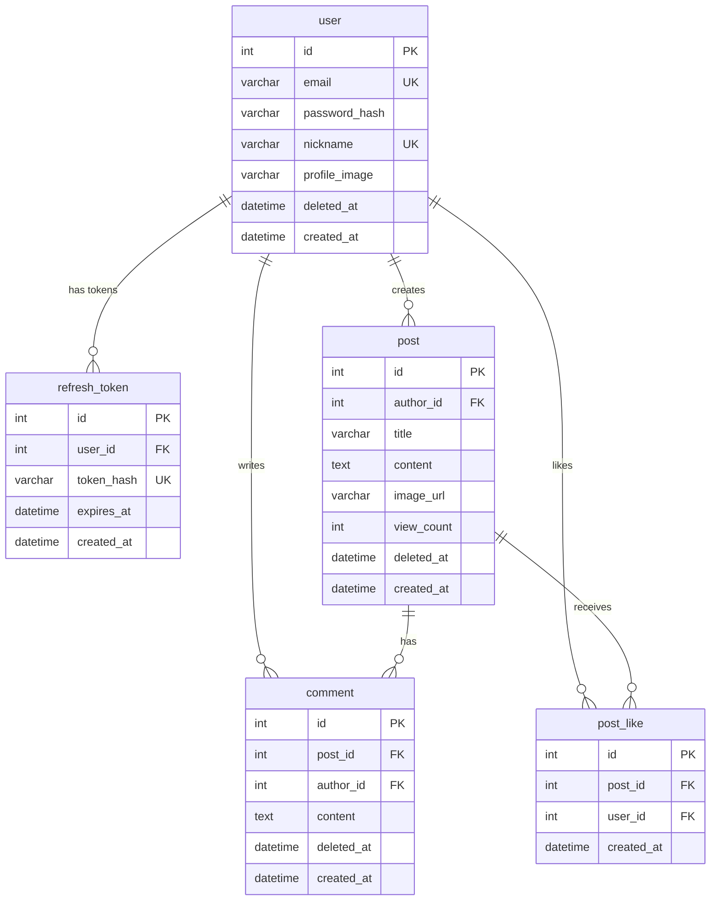
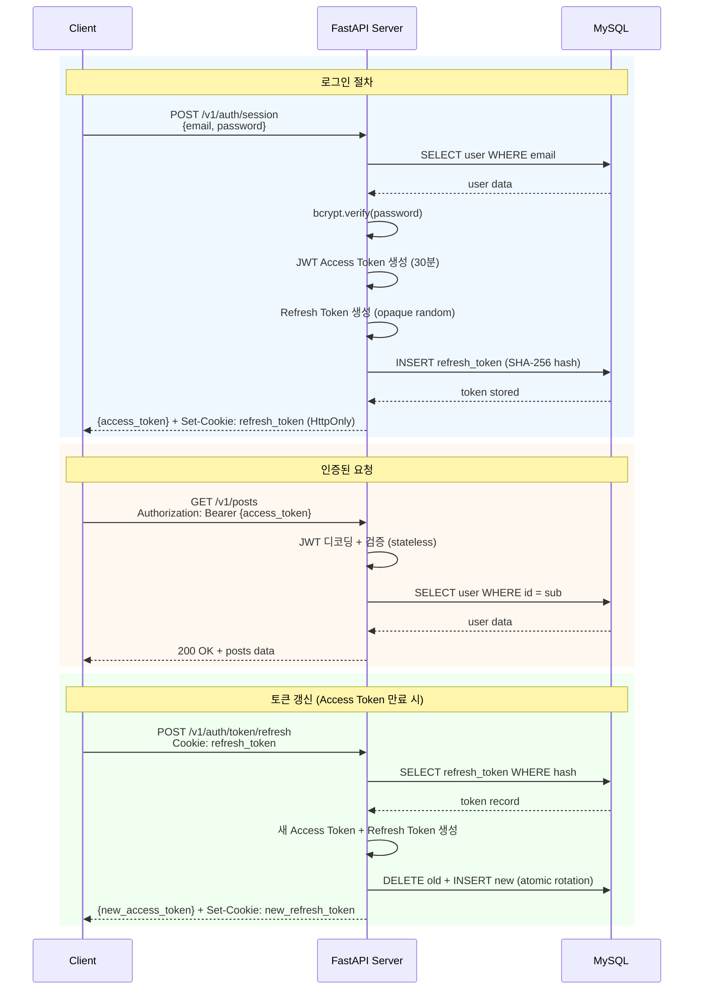

# 2-cho-community-fe

AWS AI School 2기 4주차 과제

## 요약 (Summary)

커뮤니티 포럼 "아무 말 대잔치"를 구축합니다. FastAPI를 기반으로 하는 비동기 백엔드와 Vanilla JavaScript 프론트엔드(순수 정적 파일)로 구성된 모노레포 구조이며, JWT 기반 인증(Access Token + Refresh Token)과 MySQL 데이터베이스를 사용합니다. 게시글 CRUD, 댓글, 좋아요, 회원 관리 기능을 제공합니다.

**개발 환경**: 프론트엔드는 `npm serve`를 사용하여 정적 파일을 서빙하며, Python 의존성이 없습니다. 프로덕션에서는 Docker Compose + nginx를 사용합니다.

## Quick Start (Development)

### 로컬 개발 환경

```bash
# 1. 백엔드 실행 (별도 터미널)
cd ../2-cho-community-be
source .venv/bin/activate
uvicorn main:app --reload --port 8000

# 2. 프론트엔드 실행
cd 2-cho-community-fe
npm install  # 최초 1회만 실행
npm run dev  # Port 8080

# 3. 브라우저에서 접속
# http://localhost:8080
```

**참고**: 프론트엔드는 순수 정적 파일(HTML/CSS/JS)로 구성되어 있으며 Python 의존성이 없습니다. 개발 환경에서는 `npm serve`를 사용하여 정적 파일을 서빙합니다.

## 배경 (Background)

AWS AI School 2기의 개인 프로젝트로 커뮤니티 서비스를 개발해야 합니다. 수강생들이 자유롭게 소통할 수 있는 공간이 필요하며, 실무에서 자주 사용되는 기술 스택(FastAPI, MySQL, Vanilla JS)을 학습하고 적용하는 것이 목표입니다.

기존에 별도의 커뮤니티 플랫폼이 없어 수강생 간 교류가 제한적이었습니다. 이 서비스를 통해 학습 경험을 공유하고, 질문/답변을 주고받으며, 프로젝트 협업의 기회를 마련하고자 합니다.

## 목표 (Goals)

- 회원가입, 로그인, 로그아웃, 회원 탈퇴 기능을 제공한다.
- 게시글 작성, 조회, 수정, 삭제(CRUD) 기능을 제공한다.
- 댓글 작성, 수정, 삭제 기능을 제공한다.
- 게시글 좋아요/좋아요 취소 기능을 제공한다.
- 프로필 이미지 및 닉네임 수정 기능을 제공한다.
- 무한 스크롤 기반의 게시글 목록을 제공한다.
- 모바일/데스크탑 반응형 UI를 제공한다.

## 목표가 아닌 것 (Non-Goals)

- 실시간 알림 기능 (WebSocket)
- 게시글 검색 기능
- 대댓글(nested comments) 기능
- 소셜 로그인 (OAuth)
- 이메일 인증 및 비밀번호 찾기
- 관리자 대시보드
- 게시글 카테고리 또는 태그 기능

## 계획 (Plan)

### 1. 시스템 아키텍처


## 프로덕션 배포 (Production Deployment)

프로덕션 환경에서는 **Docker Compose + 단일 EC2**로 운영합니다. nginx가 정적 파일 서빙과 API 리버스 프록시를 담당합니다.

### Docker Compose Architecture



### 주요 특징

- **Same-Origin Architecture**: nginx가 단일 도메인에서 정적 파일과 API를 모두 서빙하여 CORS 이슈 없음
- **Cookie Security**: `SameSite=Lax` (Refresh Token 쿠키, HttpOnly)
- **Let's Encrypt SSL**: nginx에서 HTTPS 처리 (`/etc/letsencrypt/live/my-community.shop/`)
- **Clean URLs**: nginx rewrite로 `/main` → `post_list.html` 등 지원

### 배포 방법

```bash
# EC2에서 Docker Compose로 배포
cd /path/to/my-community

# 이미지 빌드 (최초 또는 변경 시)
docker build -t my-community-db:latest ./2-cho-community-be/database
docker build -t my-community-be:latest ./2-cho-community-be
docker build -t my-community-fe:latest ./2-cho-community-fe

# 컨테이너 실행
docker compose -f docker-compose.prod.yml up -d --no-pull
```

### 핵심 설정

**프론트엔드 API 설정** (`js/config.js`):

```javascript
const IS_LOCAL = window.location.hostname === 'localhost' ||
                 window.location.hostname === '127.0.0.1';

export const API_BASE_URL = IS_LOCAL
    ? "http://127.0.0.1:8000"  // 로컬: 백엔드 직접 연결
    : "";  // 프로덕션: same-origin (nginx가 /v1/* 를 backend:8000으로 프록시)
```

### 2. 데이터베이스 설계

#### ERD



#### 주요 설계 결정

- **Soft Delete**: `user`, `post`, `comment` 테이블에 `deleted_at` 컬럼 사용. 물리적 삭제 대신 논리적 삭제로 데이터 보존.
- **JWT 기반 인증**: Access Token(30분, HS256) + Refresh Token(7일, opaque random). Access Token은 프론트엔드 in-memory 저장, Refresh Token은 HttpOnly 쿠키 + SHA-256 해시 DB 저장. JWT payload에는 `sub`(user_id)만 포함하여 PII 노출 방지. 토큰 회전(rotation)으로 탈취 시 자동 무효화.
- **인덱스 전략**:
  - `idx_refresh_token_hash`: Refresh Token 해시 조회
  - `idx_post_created_deleted`: 최신순 게시글 목록 조회
  - `idx_comment_post_deleted`: 게시글별 댓글 목록 조회

### 3. API 설계

#### 인증 API (`/v1/auth`)

| Method | Endpoint | 설명 | 인증 |
| ------ | -------- | ---- | ---- |
| POST | `/v1/auth/session` | 로그인 (Access Token + Refresh Token 발급) | X |
| DELETE | `/v1/auth/session` | 로그아웃 (Refresh Token 무효화) | O |
| POST | `/v1/auth/token/refresh` | 토큰 갱신 (Refresh Token → 새 Access Token) | X (쿠키) |
| GET | `/v1/auth/me` | 현재 사용자 정보 | O |

#### 사용자 API (`/v1/users`)

| Method | Endpoint | 설명 | 인증 |
| ------ | -------- | ---- | ---- |
| POST | `/v1/users` | 회원가입 | X |
| GET | `/v1/users/{user_id}` | 사용자 프로필 조회 | X |
| PATCH | `/v1/users/me` | 프로필 수정 (본인) | O |
| DELETE | `/v1/users/me` | 회원 탈퇴 (본인) | O |
| PUT | `/v1/users/me/password` | 비밀번호 변경 | O |
| POST | `/v1/users/profile/image` | 프로필 이미지 업로드 | O |

#### 게시글 API (`/v1/posts`)

| Method | Endpoint | 설명 | 인증 |
| ------ | -------- | ---- | ---- |
| GET | `/v1/posts` | 게시글 목록 (페이지네이션) | X |
| POST | `/v1/posts` | 게시글 작성 | O |
| GET | `/v1/posts/{post_id}` | 게시글 상세 조회 | X |
| PATCH | `/v1/posts/{post_id}` | 게시글 수정 | O (작성자) |
| DELETE | `/v1/posts/{post_id}` | 게시글 삭제 | O (작성자) |
| POST | `/v1/posts/{post_id}/likes` | 좋아요 | O |
| DELETE | `/v1/posts/{post_id}/likes` | 좋아요 취소 | O |
| POST | `/v1/posts/{post_id}/comments` | 댓글 작성 | O |
| PUT | `/v1/posts/{post_id}/comments/{comment_id}` | 댓글 수정 | O (작성자) |
| DELETE | `/v1/posts/{post_id}/comments/{comment_id}` | 댓글 삭제 | O (작성자) |
| POST | `/v1/posts/image` | 게시글 이미지 업로드 | O |

#### 응답 형식

```json
{
  "code": 200,
  "message": "성공",
  "data": { },
  "errors": null,
  "timestamp": "2024-01-01T00:00:00Z"
}
```

#### 에러 코드

| HTTP Status | 설명 |
| ----------- | ---- |
| 400 | 잘못된 요청 (유효성 검사 실패) |
| 401 | 인증 필요 (토큰 만료/미로그인) |
| 403 | 권한 없음 (타인의 게시글 수정 시도 등) |
| 404 | 리소스 없음 |
| 409 | 충돌 (이메일/닉네임 중복) |
| 500 | 서버 오류 |

### 4. 인증 흐름



### 5. 프론트엔드 아키텍처

#### 디렉토리 구조

```text
2-cho-community-fe/
├── html/                    # 8개 정적 HTML 페이지
│   ├── post_list.html       # 메인 피드
│   ├── post_detail.html     # 게시글 상세
│   ├── post_write.html      # 게시글 작성
│   ├── post_edit.html       # 게시글 수정
│   ├── user_login.html      # 로그인
│   ├── user_signup.html     # 회원가입
│   ├── user_password.html   # 비밀번호 변경
│   └── user_edit.html       # 프로필 수정
│
├── js/
│   ├── app/                 # 페이지별 진입점
│   ├── controllers/         # 비즈니스 로직
│   ├── models/              # API 통신 계층
│   ├── views/               # DOM 렌더링
│   ├── services/            # ApiService (HTTP 클라이언트)
│   ├── utils/               # Logger, Validators, Formatters
│   ├── config.js            # API_BASE_URL
│   └── constants.js         # 엔드포인트, 메시지, 라우트
│
└── css/
    ├── style.css            # 마스터 import
    ├── base.css             # 리셋, 타이포그래피
    ├── layout.css           # 헤더, 컨테이너
    ├── modules/             # 재사용 컴포넌트 (버튼, 폼, 카드, 모달, 토스트)
    └── pages/               # 페이지별 스타일
```

#### MVC 패턴

- **Model**: API 호출 담당. `AuthModel`, `PostModel`, `UserModel`, `CommentModel`
- **View**: DOM 렌더링. 정적 메서드로 HTML 생성 및 이벤트 바인딩
- **Controller**: 비즈니스 로직. Model과 View 조정, 상태 관리 (`MainController`, `DetailController`, `WriteController` 등)

#### 주요 패턴

- **정적 메서드**: 모든 클래스가 static 메서드만 사용
- **IntersectionObserver**: 무한 스크롤 구현
- **Custom Event**: `auth:session-expired` 이벤트로 401 처리 (silent refresh 실패 시 발생)
- **XSS 방지**: `escapeHtml()` 유틸리티로 사용자 입력 이스케이프
- **성능 최적화**: 
  - **Lazy Loading**: `loading="lazy"` 속성으로 이미지 로딩 지연
  - **Debounce**: 입력 이벤트(회원가입 등) 제어로 불필요한 연산 방지
- **에러 처리**: `ErrorBoundary`를 통한 재시도 로직 및 에러 복구 전략

### 6. 보안 고려사항

| 항목 | 구현 방식 |
| ---- | --------- |
| 비밀번호 해싱 | `bcrypt` (cost factor 12) |
| JWT 인증 | Access Token(30분, in-memory) + Refresh Token(7일, HttpOnly Cookie, SHA-256 해시 DB 저장) |
| CORS | 허용 출처 명시적 설정 (`localhost:8080`) |
| SQL Injection | Parameterized queries (`aiomysql`) |
| XSS | 프론트엔드에서 `escapeHtml()` 적용 |
| Timing Attack | 로그인 시 존재하지 않는 사용자도 `bcrypt` 검증 수행 |

### 7. 비밀번호 정책

- 길이: 8-20자
- 필수 포함: 대문자, 소문자, 숫자, 특수문자

## 이외 고려 사항들 (Other Considerations)

- **JWT 인증**: Access Token(HS256, 30분) + Refresh Token(opaque random, 7일) 이중 토큰 전략 사용. Access Token은 프론트엔드 in-memory(JS 변수)에 저장하여 XSS 노출 최소화, Refresh Token은 HttpOnly 쿠키로 전달하고 SHA-256 해시로 DB에 저장. 토큰 회전(rotation)을 통해 Refresh Token 탈취 시 자동 무효화. CSRF 미들웨어는 제거됨 (Bearer 토큰이 CSRF 방어 역할).
- **ORM vs Raw SQL**: SQLAlchemy 등 ORM 사용을 고려했으나, 학습 목적으로 raw SQL을 직접 작성하여 쿼리 최적화 경험을 쌓기로 결정.
- **Vanilla JS**: React, Vue 등 프레임워크 대신 Vanilla JS를 선택. 프레임워크 학습 비용 없이 JavaScript 기본기를 다지는 것이 목표.
- **이미지 저장소**: Docker 환경에서는 `/app/uploads` 볼륨에 저장. 로컬 개발 시에도 로컬 파일시스템 사용.
- **Soft Delete**: 물리적 삭제 대신 `deleted_at` 컬럼 사용. 데이터 복구 가능성 확보 및 FK 무결성 유지.

## 마일스톤 (Milestones)

| 단계 | 기간 | 내용 |
| ---- | ---- | ---- |
| 1단계 | 1주차 | DB 스키마 설계, 백엔드 프로젝트 셋업, 인증 API 구현 |
| 2단계 | 2주차 | 게시글/댓글/좋아요 API 구현, 이미지 업로드 |
| 3단계 | 3주차 | 프론트엔드 구현 (HTML/CSS/JS), API 연동 |
| 4단계 | 4주차 | E2E 테스트 작성, QA, 버그 수정 |
| 5단계 | 5주차 | 문서화, 코드 리뷰, 최종 배포 |

## changelog

### 최근 변경사항 (Recent Changes)

#### 2026-02-25: GitHub Actions CI/CD 추가

- `.github/workflows/deploy.yml` 신규 생성
- main 브랜치 push 시 자동 배포: Docker 이미지 빌드 → ECR 푸시 → EC2 SSH 배포
- paths 필터: `.html`, `.css`, `.js`, `Dockerfile`, `nginx/**` 변경 시에만 실행

#### 2026-02-25: JWT payload 최소화 + 코드 리뷰 수정

- JWT payload에서 민감한 개인정보 제거: `email`, `nickname`, `role` 클레임 삭제, `sub`(user_id)만 유지
- 백엔드 파일명/변수명 개선, 주석 정리

#### 2026-02-25: JWT 인증으로 전환 (세션 기반 → JWT)

**인증 방식 변경**:
- 서버 사이드 세션 → JWT (Access Token 30분 + Refresh Token 7일)
- CSRF 미들웨어 제거 (Bearer 토큰이 CSRF 방어 역할)
- SessionMiddleware 제거

**프론트엔드 변경**:
- `ApiService.js`: Bearer 토큰 관리 (`Authorization: Bearer <token>` 헤더), silent refresh, thundering herd 보호 (`_refreshing` 싱글턴 Promise)
- `AuthModel.js`: 페이지 새로고침 시 HttpOnly 쿠키로 silent refresh (`POST /v1/auth/token/refresh`)
- `constants.js`: `AUTH.REFRESH`, `AUTH.ME` 엔드포인트 상수 추가
- CSRF 토큰 관련 코드 완전 제거 (`getCsrfToken()`, `X-CSRF-Token` 헤더)

---

#### 2026-02-24: Docker Compose + 단일 EC2 배포로 전환

**아키텍처 변경**:

- CloudFront + S3 + ELB → Docker Compose + 단일 EC2
- nginx 컨테이너: 정적 파일 서빙 + 리버스 프록시 (`/v1/*` → backend:8000)
- 백엔드 컨테이너: FastAPI + uvicorn
- 데이터베이스 컨테이너: MySQL 9.6

**주요 변경 사항**:

1. `docker-compose.prod.yml`로 전체 스택 통합 관리
2. nginx가 Let's Encrypt SSL 처리 (`/etc/letsencrypt/`)
3. Clean URL 지원 (`/main` → `post_list.html`)
4. 이미지 저장소를 Docker 볼륨으로 변경 (`/app/uploads`)

---

#### 2026-02-19: CloudFront + S3 배포 전환 (현재 미사용)

**아키텍처 변경** (이전 방식):

- Single-Origin Nginx (EC2) → CloudFront + S3 + ELB
- 정적 파일: S3 버킷 (`my-community-s3-fe`) + CloudFront CDN
- API 요청: CloudFront `/v1/*` behavior → ELB → EC2:8000 (uvicorn)

---

#### 2026-02-12: Single-Origin Nginx Deployment 설정

**아키텍처 변경**:

- Cross-Domain (S3 + EC2) → **Single-Origin (Nginx Reverse Proxy)**
- Frontend EC2 (nginx)가 정적 파일을 서빙하고 `/v1/*` 요청을 Backend EC2로 프록시

**코드 변경**:

1. **`js/config.js`**: API_BASE_URL 설정 변경
   ```javascript
   // 프로덕션: 빈 문자열 (same-origin)
   export const API_BASE_URL = IS_LOCAL ? "http://127.0.0.1:8000" : "";
   ```

2. **쿠키 설정** (백엔드 변경 사항):
   - Refresh Token Cookie: `SameSite=Lax`, `HttpOnly`, `path=/v1/auth`
   - `Secure` 플래그: `HTTPS_ONLY` 환경변수로 제어 (선택적 HTTPS)
   - *(참고: 2026-02-25에 세션/CSRF 쿠키가 JWT로 대체됨)*

---

- 2026-02-12: 프론트엔드 개발 환경 정리 및 `npm serve` 마이그레이션 완료
  - Python 의존성 완전 제거
    - 가상 환경 삭제
    - `pyproject.toml`, `2_cho_community_fe.egg-info/`, `__pycache__/`, `build/` 삭제
    - 프론트엔드는 순수 정적 파일(HTML/CSS/JS)로 Python 의존성 없음
  - 개발 서버 변경
    - FastAPI/uvicorn 개발 서버 → `npm serve`
    - 로컬 개발: `npm run dev` 명령어 사용
    - 프로덕션: nginx로 정적 파일 서빙
  - 문서 업데이트
    - README.md: 시스템 아키텍처 다이어그램 업데이트

- 2026-02-09: 코드 리뷰 기반 주요 이슈 수정
  - 런타임 에러 수정
    - `js/views/ProfileView.js`: escapeCssUrl import 경로 오류 수정
      - 문제: `escapeCssUrl`을 `./helpers.js`에서 import 시도 → 함수가 존재하지 않아 런타임 에러
      - 수정: `../utils/formatters.js`에서 import하도록 경로 변경
      - 영향: 프로필 편집 페이지 정상 로딩, 사용자 경험 복구

- 2026-02-09: CSRF Protection 구현
  - Double Submit Cookie 패턴 클라이언트 구현
    - `js/services/ApiService.js`: CSRF 토큰 자동 포함
    - getCsrfToken(): 쿠키에서 토큰 읽기
    - 모든 상태 변경 요청(`POST`/`PUT`/`PATCH`/`DELETE`)에 X-CSRF-Token 헤더 자동 추가
  - 보안 & 안정성 개선
    - 메모리 누수 수정: `js/views/HeaderView.js::cleanup()` 메서드 추가 (전역 이벤트 리스너 정리)
    - 민감 정보 로깅 제거: `js/views/helpers.js::getImageUrl()` console.warn 삭제
    - 중복 제출 방지: `js/controllers/CommentController.js::submitComment()` isSubmitting 플래그 추가

- 2026-02-09: XSS 정책 100% 준수 완료
  - innerHTML 완전 제거
    - `js/utils/ErrorBoundary.js`: innerHTML 사용 제거, clearElement() 사용
  - CSS Injection 방어
    - `js/views/ProfileView.js`: escapeCssUrl 누락 수정 (setProfileImage, showProfilePreview)
    - 모든 backgroundImage에 escapeCssUrl 적용 완료
  - URL Sanitization 강화
    - `js/views/helpers.js::getImageUrl()`: 위험한 프로토콜 명시적 차단
    - javascript:, vbscript:, file:, data:text/html 등 차단
    - data:image/* MIME type만 허용하는 whitelist 방식 적용

- 2026-02-06: XSS 취약점 방어
  - innerHTML 대신 DOM API를 사용
  - XSS 테스트 코드 추가

- 2026-02-04: 성능 최적화
  - 이미지 Lazy Loading 적용
    - 게시글 상세 이미지에 `loading="lazy"` 속성 추가 (`PostDetailView.js`)
  - 이벤트 성능 최적화
    - `debounce` 유틸리티 추가 (`js/utils/debounce.js`)
    - 회원가입 입력(닉네임, 이메일) 유효성 검사에 300ms 디바운스 적용

- 2026-02-04: 컴포넌트 개선
  - 에러 바운더리 및 재시도 로직 도입 (`js/utils/ErrorBoundary.js`)
    - 지수 백오프(Exponential Backoff) 기반 재시도
    - 네트워크 에러 및 5xx/429 에러 자동 복구
  - `ApiService` 안정성 강화
    - GET 요청에 대해 자동 재시도 적용 (최대 2회)
    - 에러/로딩 UI 스타일 추가 (`css/modules/animations.css`)

- 2026-02-04: UX 개선
  - 애니메이션 모듈 추가 (`css/modules/animations.css`)
    - 페이지 전환 fade 효과 (body fadeIn)
    - 로딩 스켈레톤 스타일 (`.skeleton`, `.skeleton-post`, `.skeleton-avatar`)
    - 버튼 hover/active 애니메이션 (`translateY`, `box-shadow`)
    - 스피너 컴포넌트 (`.spinner`, .`btn-loading`)
    - 입력 필드 포커스 효과 (`border-color`, `box-shadow`)
    - 좋아요 버튼 `heartPop` 애니메이션
    - 토스트 `slideUp` 애니메이션
    - 모달 `scale` 전환 효과

- 2026-02-04
  - 코드 리팩토링
    - `SignupView.js`의 반복적인 에러 표시/숨기기 메서드를 `showFieldError`/`hideFieldError`로 통합
    - `WriteController`, `EditController`, `DetailController`의 중복된 리다이렉트 로직을 `showToastAndRedirect` 헬퍼로 통합
    - 하드코딩된 내비게이션 경로를 `NAV_PATHS` 상수로 통일 (`js/constants.js`)
    - UI 메시지를 `UI_MESSAGES` 상수로 통합하고 `IMAGE_UPLOAD_FAIL`, `POST_CREATE_SUCCESS` 등 누락된 메시지 추가
    - 이미지 업로드 결과 처리 로직(`extractUploadedImageUrl`)을 `helpers.js`로 캡슐화
    - `SignupController.js` 리팩토링: `showToastAndRedirect`, `NAV_PATHS` 적용 및 코드 중복 제거

- 2026-02-04
  - 보안 일관성 개선
    - `PostListView`, `HeaderView`, `CommentListView`에 `escapeCssUrl` 적용
    - `PostFormView`, `HeaderView`의 `innerHTML` 사용을 `createElement`/`textContent`로 교체
    - `CommentListView`, `HeaderController`의 `innerHTML = ''`을 `textContent = ''`로 교체
  - 프론트엔드 코드 품질 개선
    - `MainController.js` 불필요한 빈 줄 정리 (357줄 → 141줄) 및 미사용 import 제거
    - `DetailController`의 불필요한 응답 fallback 코드 제거
  - 성능 개선
    - 댓글 변경 시 전체 게시글 리로드 대신 댓글 목록만 부분 업데이트 (`_reloadComments`)

- 2026-02-02
  - XSS 공격 방어를 위한 이스케이프 함수 추가
  - 좋아요 에러 핸들링 및 롤백
  - 네트워크 에러 처리
  - API 엔드포인트를 상수로 관리하도록 수정 (`js/constants.js`)
  - 닉네임 검증 로직 수정
  - `formatDate` null 체크 추가
  - 메모리 누수 방지
  - MVC 아키텍처 위반 수정
  - 렌더링 성능 최적화
  - 컨트롤러 구조 개선
  - 코드 중복 제거 및 리팩토링
  - 테크 스펙 작성
  - AI 에이전트 도입
  - 인피니티 스크롤 로직 개선
  - CSS 로딩 최적화

- 2026-01-30
  - 401 에러 발생 시 로그인 페이지로 리다이렉션
  - UI 개선
  - 프로필 수정 페이지에서 회원탈퇴 버튼 추가
  - 회원탈퇴 모달 추가
  - 회원탈퇴 기능 추가
- 2026-01-29
  - 로그인 안된 상태면 로그인 페이지로 리다이렉션
  - 가독성을 높이기 위해 html 파일 이름 변경
  - 게시물 목록의 끝에 와도 인피니티 스크롤링이 계속되던 버그 해결
  - 로그 기능 추가
  - 프로필 수정 후 게시글 목록 페이지로 리다이렉션하도록 수정
  - 더미 데이터 삽입 후 인피니티 스크롤링이 안되던 이슈 해결
  - `Jinja2Templates`와 `TemplateResponse` 의존성 제거
  - HTML 인라인 스타일 제거
  - 헤더 프로필 아이콘 사이즈 조정
  - `auth-section`을 드롭다운 메뉴를 위한 ID로 한정
  - 회원탈퇴 로직 수정
  - `alert()` 대신 토스트 알림 추가
  - API 엔드포인트 정리
- 2026-01-28
  - MVC 모델에 더욱 충실하도록 재구성
  - 프로필 이미지가 제대로 표시되지 않는 이슈 해결
  - 게시글 상세 조회 페이지에서 이미지가 제대로 출력되지 않던 이슈 해결
  - 게시글 작성/수정 페이지에서 이미지 파일 이름이 나오지 않던 이슈 해결
- 2026-01-25
  - 프로젝트 구조 리팩토링
    - MVC 패턴 도입 (Model, View, Controller 분리)
  - 게시글 상세 페이지
    - 좋아요/조회수/댓글 통계 UI 디자인 개선
  - 프로필 수정 페이지
    - 프로필 이미지 업로드 UI 개선 (원형 디자인, 변경 버튼 오버레이)
- 2026-01-23
  - 헤더 프로필 아이콘에 드롭다운 메뉴 추가
  - 비밀번호 수정 페이지
    - 비밀번호 수정
  - 프로필 수정 페이지
    - 프로필 수정
    - 프로필 사진 업로드
    - 닉네임 수정
    - 닉네임 중복 확인
  - 게시물 수정 페이지
    - 게시물 수정
  - 게시물 작성 페이지
    - 게시물 작성
  - 게시글 상세 페이지
    - 댓글 작성
    - 댓글 삭제
    - 댓글 수정
    - 게시글 삭제
    - 게시글 수정
    - 좋아요/좋아요 취소
- 2026-01-22
  - 메인 페이지
    - 게시글 목록 불러오기
    - 무한 스크롤 구현
  - 로그인 페이지
    - 기획서에 맞게 디자인 수정
    - 예외 처리 (로그인 버튼 연타)
  - 회원가입 페이지
    - 프로필 사진 첨부 기능 추가
    - 로그인 페이지와 연결
- 2026-01-21
  - 로그인 기능 구현
  - 첫 HTML 파일 작성
  - 레포지토리 생성
