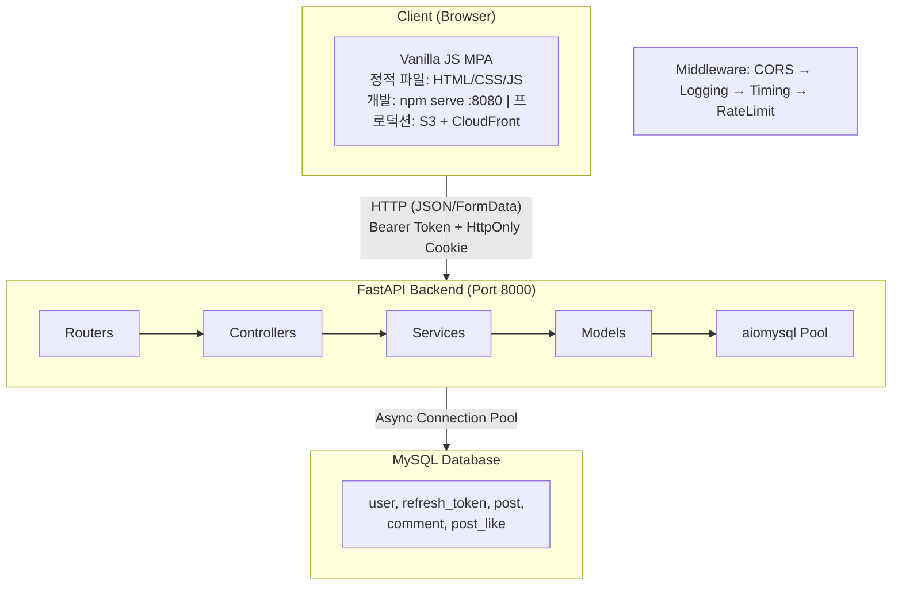
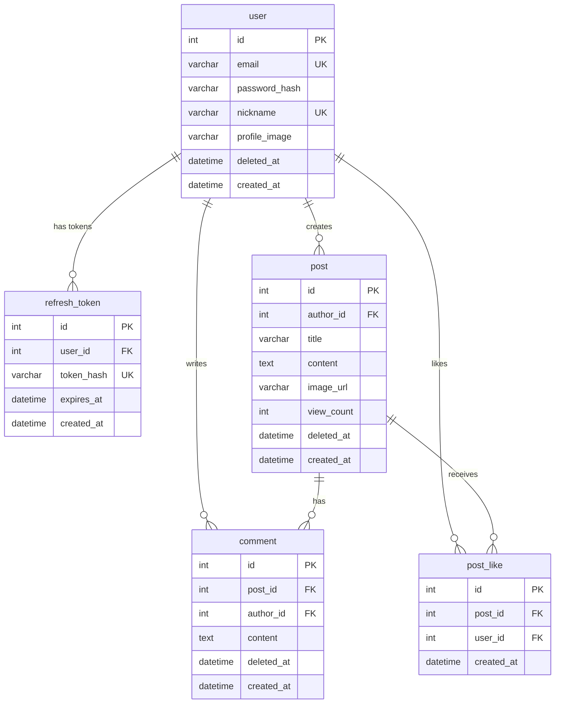
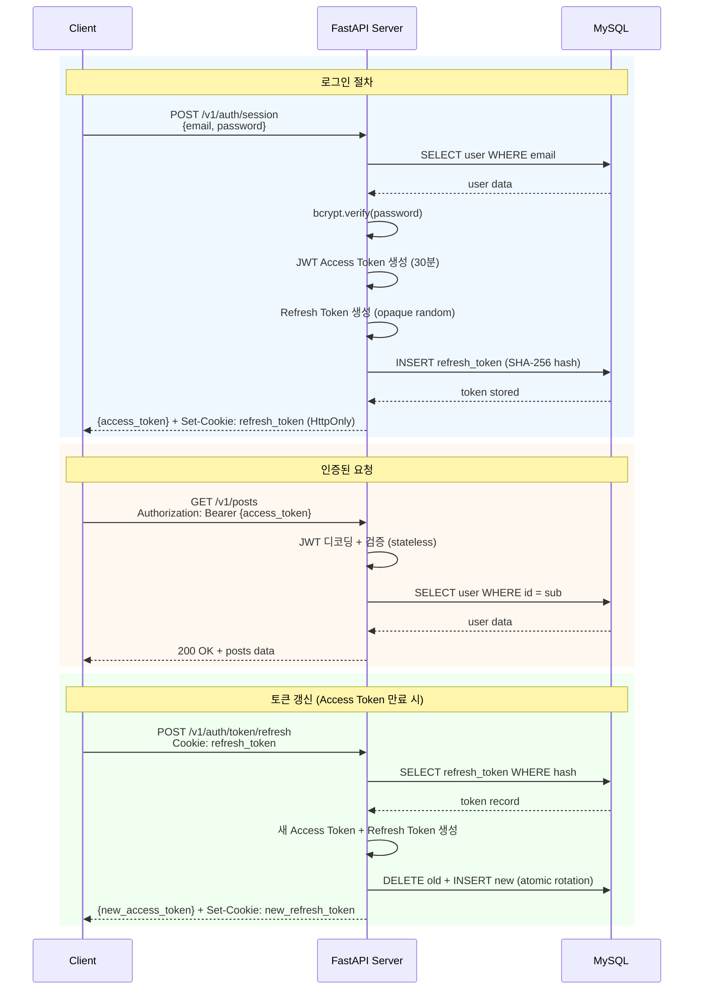

# 2-cho-community-fe

AWS AI School 2기 4주차 과제

## 요약 (Summary)

커뮤니티 포럼 "아무 말 대잔치"를 구축합니다. FastAPI를 기반으로 하는 비동기 백엔드와 Vanilla JavaScript 프론트엔드(순수 정적 파일)로 구성된 모노레포 구조이며, JWT 기반 인증(Access Token + Refresh Token)과 MySQL 데이터베이스를 사용합니다. 게시글 CRUD, 댓글, 좋아요, 회원 관리 기능을 제공합니다.

**개발 환경**: 프론트엔드는 `npm serve`를 사용하여 정적 파일을 서빙하며, Python 의존성이 없습니다. 프로덕션에서는 S3 + CloudFront를 사용합니다.

## Quick Start (Development)

### 로컬 개발 환경

```bash
# 1. 백엔드 실행 (별도 터미널)
cd ../2-cho-community-be
source .venv/bin/activate
uvicorn main:app --reload --port 8000

# 2. 프론트엔드 실행
cd 2-cho-community-fe
npm install  # 최초 1회만 실행
npm run dev  # Port 8080

# 3. 브라우저에서 접속
# http://localhost:8080
```

**참고**: 프론트엔드는 순수 정적 파일(HTML/CSS/JS)로 구성되어 있으며 Python 의존성이 없습니다. 개발 환경에서는 `npm serve`를 사용하여 정적 파일을 서빙합니다.

## 배경 (Background)

AWS AI School 2기의 개인 프로젝트로 커뮤니티 서비스를 개발해야 합니다. 수강생들이 자유롭게 소통할 수 있는 공간이 필요하며, 실무에서 자주 사용되는 기술 스택(FastAPI, MySQL, Vanilla JS)을 학습하고 적용하는 것이 목표입니다.

기존에 별도의 커뮤니티 플랫폼이 없어 수강생 간 교류가 제한적이었습니다. 이 서비스를 통해 학습 경험을 공유하고, 질문/답변을 주고받으며, 프로젝트 협업의 기회를 마련하고자 합니다.

## 목표 (Goals)

- 회원가입, 로그인, 로그아웃, 회원 탈퇴 기능을 제공한다.
- 게시글 작성, 조회, 수정, 삭제(CRUD) 기능을 제공한다.
- 댓글 작성, 수정, 삭제 기능을 제공한다. (1단계 대댓글 지원)
- 게시글 검색(제목+내용) 및 정렬(최신순/좋아요순/조회수순/댓글순) 기능을 제공한다.
- 게시글 좋아요/좋아요 취소 기능을 제공한다.
- 프로필 이미지 및 닉네임 수정 기능을 제공한다.
- 무한 스크롤 기반의 게시글 목록을 제공한다.
- 모바일/데스크탑 반응형 UI를 제공한다.

## 목표가 아닌 것 (Non-Goals)

- 실시간 알림 기능 (WebSocket)
- 소셜 로그인 (OAuth)
- 관리자 대시보드
- 게시글 카테고리 또는 태그 기능

## 계획 (Plan)

### 1. 시스템 아키텍처



### 2. 데이터베이스 설계

#### ERD



#### 주요 설계 결정

- **Soft Delete**: `user`, `post`, `comment` 테이블에 `deleted_at` 컬럼 사용. 물리적 삭제 대신 논리적 삭제로 데이터 보존.
- **JWT 기반 인증**: Access Token(30분, HS256) + Refresh Token(7일, opaque random). Access Token은 프론트엔드 in-memory 저장, Refresh Token은 HttpOnly 쿠키 + SHA-256 해시 DB 저장. JWT payload에는 `sub`(user_id)만 포함하여 PII 노출 방지. 토큰 회전(rotation)으로 탈취 시 자동 무효화.
- **인덱스 전략**:
  - `idx_refresh_token_hash`: Refresh Token 해시 조회
  - `idx_post_created_deleted`: 최신순 게시글 목록 조회
  - `idx_comment_post_deleted`: 게시글별 댓글 목록 조회

### 3. API 설계

#### 인증 API (`/v1/auth`)

| Method | Endpoint | 설명 | 인증 |
| ------ | -------- | ---- | ---- |
| POST | `/v1/auth/session` | 로그인 (Access Token + Refresh Token 발급) | X |
| DELETE | `/v1/auth/session` | 로그아웃 (Refresh Token 무효화) | O |
| POST | `/v1/auth/token/refresh` | 토큰 갱신 (Refresh Token → 새 Access Token) | X (쿠키) |
| GET | `/v1/auth/me` | 현재 사용자 정보 | O |

#### 사용자 API (`/v1/users`)

| Method | Endpoint | 설명 | 인증 |
| ------ | -------- | ---- | ---- |
| POST | `/v1/users` | 회원가입 | X |
| POST | `/v1/users/find-email` | 이메일 찾기 (닉네임 → 마스킹 이메일) | X |
| POST | `/v1/users/reset-password` | 비밀번호 재설정 (이메일 → 임시 비밀번호 발송) | X |
| GET | `/v1/users/{user_id}` | 사용자 프로필 조회 | X |
| PATCH | `/v1/users/me` | 프로필 수정 (본인) | O |
| DELETE | `/v1/users/me` | 회원 탈퇴 (본인) | O |
| PUT | `/v1/users/me/password` | 비밀번호 변경 | O |
| POST | `/v1/users/profile/image` | 프로필 이미지 업로드 | O |

#### 게시글 API (`/v1/posts`)

| Method | Endpoint | 설명 | 인증 |
| ------ | -------- | ---- | ---- |
| GET | `/v1/posts` | 게시글 목록 (페이지네이션) | X |
| POST | `/v1/posts` | 게시글 작성 | O |
| GET | `/v1/posts/{post_id}` | 게시글 상세 조회 | X |
| PATCH | `/v1/posts/{post_id}` | 게시글 수정 | O (작성자) |
| DELETE | `/v1/posts/{post_id}` | 게시글 삭제 | O (작성자) |
| POST | `/v1/posts/{post_id}/likes` | 좋아요 | O |
| DELETE | `/v1/posts/{post_id}/likes` | 좋아요 취소 | O |
| POST | `/v1/posts/{post_id}/comments` | 댓글 작성 | O |
| PUT | `/v1/posts/{post_id}/comments/{comment_id}` | 댓글 수정 | O (작성자) |
| DELETE | `/v1/posts/{post_id}/comments/{comment_id}` | 댓글 삭제 | O (작성자) |
| POST | `/v1/posts/image` | 게시글 이미지 업로드 | O |

#### 응답 형식

```json
{
  "code": 200,
  "message": "성공",
  "data": { },
  "errors": null,
  "timestamp": "2024-01-01T00:00:00Z"
}
```

#### 에러 코드

| HTTP Status | 설명 |
| ----------- | ---- |
| 400 | 잘못된 요청 (유효성 검사 실패) |
| 401 | 인증 필요 (토큰 만료/미로그인) |
| 403 | 권한 없음 (타인의 게시글 수정 시도 등) |
| 404 | 리소스 없음 |
| 409 | 충돌 (이메일/닉네임 중복) |
| 500 | 서버 오류 |

### 4. 인증 흐름



### 5. 프론트엔드 아키텍처

#### 디렉토리 구조

```text
2-cho-community-fe/
├── html/                    # 9개 정적 HTML 페이지
│   ├── post_list.html       # 메인 피드
│   ├── post_detail.html     # 게시글 상세
│   ├── post_write.html      # 게시글 작성
│   ├── post_edit.html       # 게시글 수정
│   ├── user_login.html      # 로그인
│   ├── user_signup.html     # 회원가입
│   ├── user_find_account.html # 계정 찾기 (이메일/비밀번호)
│   ├── user_password.html   # 비밀번호 변경
│   └── user_edit.html       # 프로필 수정
│
├── js/
│   ├── app/                 # 페이지별 진입점
│   ├── controllers/         # 비즈니스 로직
│   ├── models/              # API 통신 계층
│   ├── views/               # DOM 렌더링
│   ├── services/            # ApiService (HTTP 클라이언트)
│   ├── utils/               # Logger, Validators, Formatters
│   ├── config.js            # API_BASE_URL
│   └── constants.js         # 엔드포인트, 메시지, 라우트
│
└── css/
    ├── style.css            # 마스터 import
    ├── base.css             # 리셋, 타이포그래피
    ├── layout.css           # 헤더, 컨테이너
    ├── modules/             # 재사용 컴포넌트 (버튼, 폼, 카드, 모달, 토스트)
    └── pages/               # 페이지별 스타일
```

#### MVC 패턴

- **Model**: API 호출 담당. `AuthModel`, `PostModel`, `UserModel`, `CommentModel`
- **View**: DOM 렌더링. 정적 메서드로 HTML 생성 및 이벤트 바인딩
- **Controller**: 비즈니스 로직. Model과 View 조정, 상태 관리 (`MainController`, `DetailController`, `WriteController` 등)

#### 주요 패턴

- **정적 메서드**: 모든 클래스가 static 메서드만 사용
- **IntersectionObserver**: 무한 스크롤 구현
- **Custom Event**: `auth:session-expired` 이벤트로 401 처리 (silent refresh 실패 시 발생)
- **XSS 방지**: `createElement()` / `textContent` 기반 DOM 생성 (innerHTML 금지)
- **성능 최적화**: 
  - **Lazy Loading**: `loading="lazy"` 속성으로 이미지 로딩 지연
  - **Debounce**: 입력 이벤트(회원가입 등) 제어로 불필요한 연산 방지
- **에러 처리**: `ErrorBoundary`를 통한 재시도 로직 및 에러 복구 전략

### 6. 보안 고려사항

| 항목 | 구현 방식 |
| ---- | --------- |
| 비밀번호 해싱 | `bcrypt` (cost factor 12) |
| JWT 인증 | Access Token(30분, in-memory) + Refresh Token(7일, HttpOnly Cookie, SHA-256 해시 DB 저장) |
| CORS | 허용 출처 명시적 설정 (`localhost:8080`) |
| SQL Injection | Parameterized queries (`aiomysql`) |
| XSS | 프론트엔드에서 `createElement()` / `textContent` 사용 (innerHTML 금지) |
| Timing Attack | 로그인 시 존재하지 않는 사용자도 `bcrypt` 검증 수행 |

### 7. 비밀번호 정책

- 길이: 8-20자
- 필수 포함: 대문자, 소문자, 숫자, 특수문자

## 이외 고려 사항들 (Other Considerations)

- **JWT 인증**: Access Token(HS256, 30분) + Refresh Token(opaque random, 7일) 이중 토큰 전략 사용. Access Token은 프론트엔드 in-memory(JS 변수)에 저장하여 XSS 노출 최소화, Refresh Token은 HttpOnly 쿠키로 전달하고 SHA-256 해시로 DB에 저장. 토큰 회전(rotation)을 통해 Refresh Token 탈취 시 자동 무효화. CSRF 미들웨어는 제거됨 (Bearer 토큰이 CSRF 방어 역할).
- **ORM vs Raw SQL**: SQLAlchemy 등 ORM 사용을 고려했으나, 학습 목적으로 raw SQL을 직접 작성하여 쿼리 최적화 경험을 쌓기로 결정.
- **Vanilla JS**: React, Vue 등 프레임워크 대신 Vanilla JS를 선택. 프레임워크 학습 비용 없이 JavaScript 기본기를 다지는 것이 목표.
- **이미지 저장소**: 프로덕션에서는 EFS(`/mnt/uploads`)에 저장. 로컬 개발 시에도 로컬 파일시스템 사용.
- **Soft Delete**: 물리적 삭제 대신 `deleted_at` 컬럼 사용. 데이터 복구 가능성 확보 및 FK 무결성 유지.

## 마일스톤 (Milestones)

| 단계 | 기간 | 내용 |
| ---- | ---- | ---- |
| 1단계 | 1주차 | DB 스키마 설계, 백엔드 프로젝트 셋업, 인증 API 구현 |
| 2단계 | 2주차 | 게시글/댓글/좋아요 API 구현, 이미지 업로드 |
| 3단계 | 3주차 | 프론트엔드 구현 (HTML/CSS/JS), API 연동 |
| 4단계 | 4주차 | E2E 테스트 작성, QA, 버그 수정 |
| 5단계 | 5주차 | 문서화, 코드 리뷰, 최종 배포 |

## Changelog

### 2026-02 (Feb)

- **02-28: 뒤로가기 버튼 UI 통일**
  - `user_signup.html`: `<a>` 텍스트 `<` → `<button>` SVG chevron 통일 (기존 JS 바인딩 미작동 수정)
  - `user_find_account.html`: 누락된 뒤로가기 버튼 추가

- **02-28: 계정 찾기 페이지 (이메일 찾기 + 비밀번호 재설정)**
  - `user_find_account.html`: 탭 UI (이메일 찾기 / 비밀번호 찾기)
  - 이메일 찾기: 닉네임 입력 → 마스킹 이메일 결과 표시
  - 비밀번호 재설정: 이메일 입력 → 임시 비밀번호 발송 토스트
  - MVC 패턴: `FindAccountController` + `FindAccountView`, 429 Rate Limit 처리

- **02-28: 전체 코드 리뷰 기반 버그 수정**
  - Silent refresh: 401 시 토큰 갱신 후 원래 요청 자동 재시도 (`_isRetry` 플래그로 무한 루프 방지)
  - 이미지 미리보기: `post_write.html`, `post_edit.html`에 누락된 `#image-preview` 요소 추가
  - Detail 페이지 이중 인증 요청 제거 (HeaderController에서 유저 전달)
  - Dead code 정리: `escapeHtml()`, `CommentModel.getComments()`, `FormValidator.updateButtonState()` 제거

- **02-27: GitHub Actions CD 파이프라인 구축**
  - `deploy-frontend.yml`: `workflow_dispatch` → S3 sync (allowlist 기반) → CloudFront invalidation
  - OIDC 인증 (GitHub → AWS IAM Role), 환경 선택 (dev/staging/prod)
  - 허용 목록: `*.html`, `*.css`, `*.js`, 이미지, 폰트 파일만 업로드

- **02-25: JWT 인증 전환**
  - 세션 기반 → JWT (Access Token 30분 + Refresh Token 7일)
  - `ApiService.js`: Bearer 토큰 관리, silent refresh, thundering herd 보호
  - CSRF 관련 코드 완전 제거 (Bearer 토큰이 CSRF 방어 역할)

- **02-09 ~ 12: 보안 강화 + 개발 환경 개선**
  - XSS 정책 100% 준수: innerHTML 완전 제거, `escapeCssUrl` 전면 적용, URL sanitization
  - CSRF Double Submit Cookie 구현 (이후 JWT 전환으로 제거)
  - Python 의존성 제거, `npm serve` 마이그레이션 (Port 8080)

- **02-02 ~ 06: 코드 품질 + 성능**
  - `ErrorBoundary` 도입 (지수 백오프 재시도, GET 자동 재시도)
  - 애니메이션 모듈 (스켈레톤, 스피너, 토스트, 좋아요 heartPop)
  - Lazy Loading, debounce, 댓글 부분 업데이트
  - 코드 리팩토링: `NAV_PATHS`/`UI_MESSAGES` 상수 통합, 중복 제거

### 2026-01 (Jan)

- **01-28 ~ 30: 안정화 + UX**
  - MVC 패턴 강화, 이미지 표시 버그 수정
  - 회원탈퇴 모달, 토스트 알림 (`alert()` 제거)
  - 무한 스크롤 버그 수정, 401 리다이렉션

- **01-21 ~ 25: 초기 구현**
  - 전체 페이지 구현 (로그인, 회원가입, 메인, 상세, 작성, 수정, 프로필, 비밀번호)
  - MVC 패턴 도입 (Model/View/Controller 분리)
  - 무한 스크롤, 좋아요, 댓글 CRUD, 이미지 업로드
