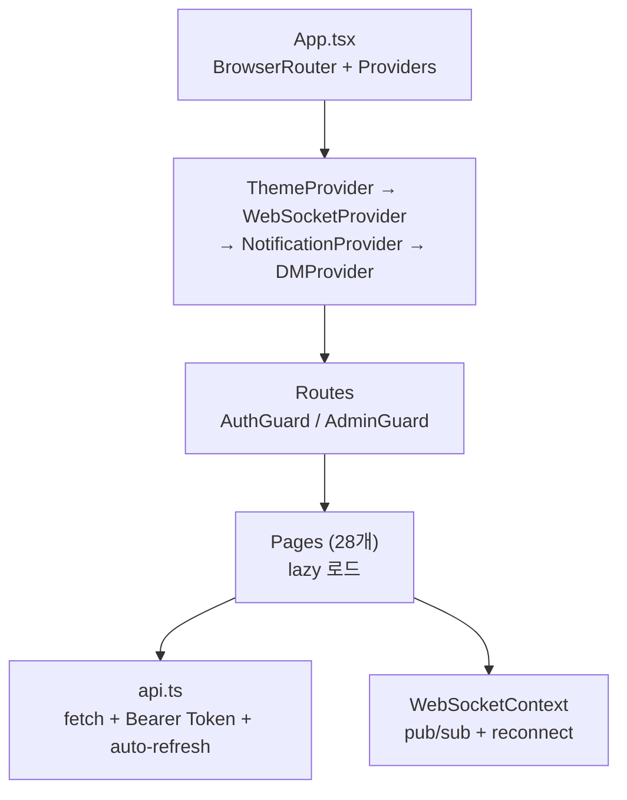

# Camp Linux — Frontend

React 19 + TypeScript SPA로 구축한 커뮤니티 포럼 프론트엔드. Terminal Editorial 디자인 시스템, 실시간 WebSocket 통신, 코드 스플리팅, 마크다운 에디터를 구현했습니다.

**Tech Stack**: React 19 · TypeScript · Vite 7 · React Router 7 · DOMPurify · marked · highlight.js · lucide-react · Playwright

**주요 기능**:

- 게시글 CRUD, 댓글(대댓글, 정렬 3종), 좋아요, 북마크, 검색(자동완성), 카테고리, 태그(자동완성), Q&A 답변 채택
- 마크다운 에디터 (코드 구문 강조, 이미지 업로드, @멘션 자동완성, 미리보기)
- 실시간 알림 (WebSocket + ETag 폴링, 유형별 설정) · DM 쪽지 · @멘션
- 팔로잉/추천 피드 · 투표(Poll, 변경/취소) · 연관 게시글 · 구독(watching) · 임시저장
- 소셜 로그인 (GitHub OAuth) · 이메일 인증 · 계정 찾기 · 비밀번호 변경
- 관리자 대시보드, 신고 관리, 계정 정지/해제
- 다크 모드 · ErrorBoundary · 코드 스플리팅 (React.lazy) · 반응형 UI

---

## 아키텍처

### React SPA + Context 패턴


```mermaid
flowchart TD
    App["App.tsx<br/>BrowserRouter + Providers"]
    Providers["ThemeProvider → WebSocketProvider<br/>→ NotificationProvider → DMProvider"]
    Routes["Routes<br/>AuthGuard / AdminGuard"]
    Pages["Pages (28개)<br/>lazy 로드"]
    API["api.ts<br/>fetch + Bearer Token + auto-refresh"]
    WS["WebSocketContext<br/>pub/sub + reconnect"]

    App --> Providers
    Providers --> Routes
    Routes --> Pages
    Pages --> API
    Pages --> WS
```

- **Context**: Auth, Theme, Notification(WS+폴링), WebSocket(pub/sub), DM
- **Hooks**: useAuth, useNotification, useDM, useWebSocket, useMention
- **API 서비스**: in-memory 토큰, 401 자동 갱신, GET 재시도(5xx/429), FormData 지원

### 디렉토리 구조

```
2-cho-community-fe/
├── index.html                 # SPA 진입점
├── vite.config.ts             # Vite + React + manualChunks
├── tsconfig.json              # TypeScript strict 모드
├── eslint.config.js           # ESLint flat config (typescript-eslint + react-hooks)
├── Dockerfile                 # 멀티 스테이지 빌드 (node → nginx)
│
├── src/
│   ├── main.tsx               # React 루트 렌더링
│   ├── App.tsx                # 라우터 + Provider 트리 + ErrorBoundary
│   │
│   ├── pages/                 # 28개 페이지 컴포넌트
│   │   ├── PostListPage.tsx   # 메인 피드 (검색, 정렬, 추천/팔로잉)
│   │   ├── PostDetailPage.tsx # 게시글 상세 (투표, 구독, 핀, 차단)
│   │   ├── wiki/              # 위키 7개 페이지
│   │   ├── packages/          # 패키지 4개 페이지
│   │   ├── admin/             # 관리자 2개 페이지
│   │   └── ...
│   │
│   ├── components/            # 재사용 컴포넌트
│   │   ├── PostCard.tsx       # 게시글 카드 (Link 기반)
│   │   ├── PostForm.tsx       # 게시글 폼 (투표 생성, 태그 자동완성, 임시저장)
│   │   ├── CommentList.tsx    # 댓글 트리 (대댓글, 좋아요, 채택, 신고)
│   │   ├── MarkdownEditor.tsx # 마크다운 에디터 (이미지, 멘션)
│   │   ├── MarkdownRenderer.tsx # DOMPurify 렌더러
│   │   ├── MentionDropdown.tsx # @멘션 자동완성 드롭다운
│   │   ├── PollView.tsx       # 투표 표시/참여/변경/취소
│   │   ├── ReportModal.tsx    # 신고 모달 (게시글/댓글)
│   │   ├── Sidebar.tsx        # 경로 인식 사이드바 (5개 섹션)
│   │   ├── Modal.tsx          # ARIA 모달 (useId)
│   │   ├── ErrorBoundary.tsx  # 렌더 에러 복구
│   │   ├── AuthGuard.tsx      # 인증 가드
│   │   ├── AdminGuard.tsx     # 관리자 가드
│   │   └── ...
│   │
│   ├── contexts/              # 5개 Context Provider
│   │   ├── AuthContext.tsx     # 로그인/로그아웃/토큰 관리
│   │   ├── WebSocketContext.tsx # WS pub/sub + 지수 백오프 (최대 10회)
│   │   ├── NotificationContext.tsx # ETag 폴링 + WS 실시간
│   │   ├── DMContext.tsx      # DM 상태 + WS 이벤트 구독
│   │   └── ThemeContext.tsx   # 다크/라이트 테마
│   │
│   ├── hooks/                 # 커스텀 훅
│   │   ├── useMention.ts      # @멘션 자동완성 로직
│   │   └── useAuth/useDM/useNotification/useWebSocket.ts
│   │
│   ├── services/
│   │   └── api.ts             # HTTP 클라이언트 (ApiError, refresh, retry)
│   │
│   ├── constants/             # 엔드포인트, 라우트, 메시지
│   ├── types/                 # TypeScript 타입 정의
│   ├── utils/                 # 포매터, 검증, 마크다운, 토스트
│   │
│   └── styles/                # Terminal Editorial 디자인 시스템
│       ├── variables.css      # 200+ 디자인 토큰 (라이트/다크)
│       ├── base.css           # 리셋, 타이포그래피, 유틸리티
│       ├── layout.css         # 헤더, 컨테이너, 이메일 배너
│       ├── modules/           # 재사용 컴포넌트 스타일 (22개)
│       └── pages/             # 페이지별 스타일 (12개)
│
├── public/                    # 정적 에셋
└── tests/                     # Playwright E2E 테스트
```

---

## 라우트 목록

| 경로 | 페이지 | 인증 | 설명 |
| ---- | ------ | ---- | ---- |
| `/` | PostListPage | - | 메인 피드 (검색, 정렬, 카테고리, 추천/팔로잉) |
| `/detail/:id` | PostDetailPage | - | 게시글 상세 (투표, 구독, 핀, 차단, 신고) |
| `/write` | PostWritePage | 필수 | 게시글 작성 (마크다운, 태그, 투표, 임시저장) |
| `/edit/:id` | PostEditPage | 필수 | 게시글 수정 |
| `/login` | LoginPage | - | 로그인 + GitHub OAuth |
| `/signup` | SignupPage | - | 회원가입 (프로필 이미지, 이용약관) |
| `/social-signup` | SocialSignupPage | - | 소셜 로그인 후 닉네임 설정 |
| `/find-account` | FindAccountPage | - | 이메일 찾기 / 비밀번호 재설정 |
| `/verify-email` | VerifyEmailPage | - | 이메일 인증 처리 |
| `/edit-profile` | ProfilePage | 필수 | 프로필 수정 + 회원 탈퇴 |
| `/password` | PasswordPage | 필수 | 비밀번호 변경 |
| `/user-profile/:id` | UserProfilePage | - | 사용자 프로필 (팔로우/차단/DM/정지) |
| `/notifications` | NotificationPage | 필수 | 알림 목록 + 설정 |
| `/dm` | DMPage | 필수 | DM 대화 (WebSocket 실시간) |
| `/my-activity` | MyActivityPage | 필수 | 내 활동 (글/댓글/좋아요/북마크/차단) |
| `/wiki` | WikiListPage | - | 위키 목록 (검색, 태그, 정렬) |
| `/wiki/write` | WikiWritePage | 필수 | 위키 작성 |
| `/wiki/edit/:slug` | WikiEditPage | 필수 | 위키 수정 |
| `/wiki/:slug` | WikiDetailPage | - | 위키 상세 (TOC, 태그) |
| `/wiki/:slug/history` | WikiHistoryPage | - | 편집 기록 |
| `/wiki/:slug/revisions/:n` | WikiRevisionPage | - | 특정 리비전 |
| `/wiki/:slug/diff` | WikiDiffPage | - | 리비전 비교 |
| `/packages` | PackageListPage | - | 패키지 목록 |
| `/packages/write` | PackageWritePage | 필수 | 패키지 등록 |
| `/packages/edit/:id` | PackageEditPage | 필수 | 패키지 수정 |
| `/packages/:id` | PackageDetailPage | - | 패키지 상세 + 리뷰 |
| `/admin` | AdminDashboardPage | 관리자 | 대시보드 + 사용자 관리 |
| `/admin/reports` | AdminReportsPage | 관리자 | 신고 관리 |
| `/tags/:name` | TagDetailPage | - | 태그 상세 (게시글/위키 탭) |
| `/badges` | BadgesPage | - | 배지 목록 |
| `*` | NotFoundPage | - | 404 |

---

## 빌드 최적화

| 항목 | 값 |
| ---- | -- |
| 초기 JS | ~310KB (gzip ~97KB) |
| React 벤더 | 49KB (분리 청크) |
| Markdown 청크 | 85KB (hljs core + 21언어) |
| 페이지 청크 | 1~7KB × 21개 (lazy 로드) |
| CSS | 170KB (gzip 24KB) |

---

## 개발

```bash
npm install
npm run dev          # Vite dev 서버 (127.0.0.1:8080)
npm run build        # 프로덕션 빌드
npm run lint         # ESLint + TypeScript 타입 체크
npm run typecheck    # tsc --noEmit
npm run test:e2e     # Playwright E2E 테스트
```
