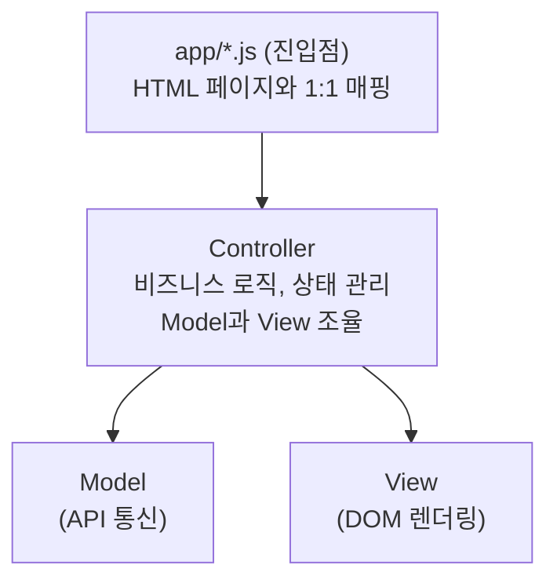

# 아무 말 대잔치 — Frontend

Vanilla JavaScript MPA로 구축한 커뮤니티 포럼 프론트엔드. 프레임워크 없이 MVC 패턴, 실시간 WebSocket 통신, 마크다운 에디터, 디자인 토큰 시스템을 직접 설계하고 구현했습니다.

**Tech Stack**: Vanilla JS (ES Modules) · Vite · marked · DOMPurify · highlight.js · Playwright

**주요 기능**:

- 게시글 CRUD, 댓글(대댓글, 정렬 3종, 수정됨 배지), 좋아요, 북마크, 검색/정렬(5종), 카테고리, 태그
- 마크다운 에디터 (GFM, 코드 구문 강조, 이미지 DnD, @멘션 자동완성, 미리보기)
- 실시간 알림 (WebSocket + 폴링 폴백) · DM 쪽지 · @멘션 하이라이트(클릭 시 프로필 이동)
- 팔로우/팔로잉 피드 · 투표(Poll, 변경/취소) · 연관 게시글 추천 · 읽은 글 표시
- 이용약관 동의 체크박스 · 에러 상태 토스트 메시지
- 관리자 대시보드, 신고 관리, 계정 정지/해제
- 다크 모드 · 임시 저장(Auto-Draft) · 무한 스크롤 · 반응형 UI

---

## 프론트엔드 아키텍처

### MVC 패턴

프레임워크의 상태 관리나 가상 DOM 없이, 클래스 기반 MVC 패턴으로 관심사를 분리합니다. 모든 클래스는 **정적 메서드(static methods)** 로만 구성되어 인스턴스 생성 없이 호출합니다.


```mermaid
flowchart TD
    Entry["app/*.js (진입점)<br/>HTML 페이지와 1:1 매핑"]
    Controller["Controller<br/>비즈니스 로직, 상태 관리<br/>Model과 View 조율"]
    Model["Model<br/>(API 통신)"]
    View["View<br/>(DOM 렌더링)"]

    Entry --> Controller
    Controller --> Model
    Controller --> View
```

- **Model**: API 통신 계층. `ApiService`를 통해 백엔드와 HTTP 통신
- **View**: DOM 렌더링. 정적 메서드로 요소 생성 및 이벤트 바인딩
- **Controller**: 비즈니스 로직. 사용자 입력 처리, Model/View 조율, 상태 관리

### 디렉토리 구조

```
2-cho-community-fe/
├── *.html                     # 18개 HTML 페이지 (루트 레벨)
├── vite.config.js             # Vite MPA 설정 + 클린 URL 리라이트
├── Dockerfile                 # 멀티 스테이지 빌드 (node → nginx)
├── nginx.conf                 # 프로덕션 서빙 설정
│
├── js/
│   ├── app/                   # 페이지별 진입점 (HTML과 1:1 매핑)
│   │   ├── main.js            # 게시글 목록
│   │   ├── detail.js          # 게시글 상세
│   │   ├── write.js           # 게시글 작성
│   │   ├── dm_list.js         # DM 대화 목록
│   │   ├── dm.js              # DM 데스크톱 통합 (좌우 분할)
│   │   └── ...                # 총 18개
│   │
│   ├── controllers/           # 비즈니스 로직 (20개)
│   │   ├── MainController.js
│   │   ├── DetailController.js
│   │   ├── HeaderController.js  # 인증 상태, 알림 뱃지, WebSocket 관리
│   │   ├── DMPageController.js  # DM 데스크톱 좌우 분할 오케스트레이션
│   │   └── ...
│   │
│   ├── models/                # API 통신 계층 (10개)
│   │   ├── PostModel.js
│   │   ├── AuthModel.js
│   │   ├── DMModel.js
│   │   └── ...
│   │
│   ├── views/                 # DOM 렌더링 (22개)
│   │   ├── PostListView.js
│   │   ├── PostDetailView.js
│   │   ├── ModalView.js
│   │   └── ...
│   │
│   ├── components/            # 재사용 UI 컴포넌트
│   │   ├── MarkdownEditor.js  # 마크다운 에디터 (풀/컴팩트 모드)
│   │   └── MentionDropdown.js # @멘션 자동완성 (게시글/댓글 에디터 연결)
│   │
│   ├── services/              # 인프라 서비스
│   │   ├── ApiService.js      # HTTP 클라이언트, Bearer 토큰, silent refresh
│   │   ├── WebSocketService.js # 실시간 알림 (싱글턴, 지수 백오프)
│   │   ├── DraftService.js    # 임시 저장 (localStorage, 디바운스)
│   │   └── ThemeService.js    # 다크 모드 토글
│   │
│   ├── utils/                 # 유틸리티
│   │   ├── dom.js             # createElement() — XSS 방지 DOM 생성
│   │   ├── icons.js           # SVG 아이콘 팩토리 (createElementNS)
│   │   ├── markdown.js        # marked + DOMPurify 렌더링 파이프라인
│   │   ├── mention.js         # @멘션 TreeWalker 하이라이트 (클릭 시 프로필 이동)
│   │   ├── ErrorBoundary.js   # 지수 백오프 재시도
│   │   └── ...
│   │
│   ├── config.js              # API_BASE_URL, WS_BASE_URL
│   └── constants.js           # 엔드포인트, 메시지, 라우트 상수
│
└── css/
    ├── style.css              # @import 진입점
    ├── variables.css           # 60+ 디자인 토큰
    ├── base.css               # 리셋, 타이포그래피
    ├── layout.css             # 헤더, 컨테이너
    ├── modules/               # 재사용 컴포넌트 스타일 (16개)
    │   ├── cards.css
    │   ├── markdown.css
    │   ├── responsive.css     # 모바일 반응형 미디어 쿼리
    │   ├── dm.css
    │   └── ...
    └── pages/                 # 페이지별 스타일 (7개)
```

---

## 페이지 목록

| 클린 URL | HTML 파일 | 설명 |
| -------- | --------- | ---- |
| `/main` | `post_list.html` | 메인 피드 — 카테고리 탭, 검색, 정렬(5종), 팔로잉 필터, 무한 스크롤 |
| `/detail?id=` | `post_detail.html` | 게시글 상세 — 마크다운 렌더링, 좋아요/북마크/공유, 댓글 트리(정렬 3종, 수정됨 배지), @멘션 하이라이트, 투표(변경/취소), 연관 게시글 |
| `/write` | `post_write.html` | 게시글 작성 — 마크다운 에디터(14버튼), 카테고리, 태그, 다중 이미지, 투표, 임시 저장 |
| `/edit?id=` | `post_edit.html` | 게시글 수정 — 기존 데이터 프리필, 이미지 관리 |
| `/login` | `user_login.html` | 로그인 — 정지 사용자 안내, 이메일 인증 유도 |
| `/signup` | `user_signup.html` | 회원가입 — 실시간 유효성 검사, 프로필 이미지, 이용약관 동의 |
| `/find-account` | `user_find_account.html` | 계정 찾기 — 탭 UI (이메일 찾기 / 비밀번호 재설정) |
| `/password` | `user_password.html` | 비밀번호 변경 |
| `/edit-profile` | `user_edit.html` | 프로필 수정 — 닉네임, 프로필 이미지 |
| `/user-profile?id=` | `user-profile.html` | 사용자 프로필 — 작성 글, 팔로우/차단/DM, 팔로워·팔로잉 목록 모달, 관리자 정지 |
| `/notifications` | `notifications.html` | 알림 — 좋아요/댓글/멘션/팔로우, 읽음/삭제, 무한 스크롤 |
| `/my-activity` | `my-activity.html` | 내 활동 — 탭 UI (글/댓글/좋아요/북마크/차단) |
| `/verify-email` | `verify-email.html` | 이메일 인증 결과 표시 |
| `/messages` | `dm_list.html` | DM 대화 목록 — 최근 메시지 미리보기, 읽지 않은 수 |
| `/messages/inbox` | `dm.html` | DM 데스크톱 통합 — 좌우 분할 레이아웃 (768px 이상 자동 전환) |
| `/messages/detail?id=` | `dm_detail.html` | DM 상세 — 실시간 메시지 수신, 마크다운 컴팩트 에디터 |
| `/admin/reports` | `admin_reports.html` | 관리자 신고 관리 — 상태 필터, 처리/기각, 정지 연동 |
| `/admin/dashboard` | `admin_dashboard.html` | 관리자 대시보드 — 통계 카드, 일별 추이, 사용자 관리 |

---

## 핵심 패턴

### ApiService — HTTP 클라이언트

중앙 집중식 HTTP 클라이언트로 모든 API 통신을 관리합니다.

- **Bearer 토큰 관리**: Access Token을 in-memory(JS 변수)에 저장하여 XSS 노출 최소화
- **Silent Refresh**: 401 응답 시 Refresh Token(HttpOnly 쿠키)으로 자동 갱신 → 원래 요청 재시도
- **무한 루프 방지**: `_isRetry` 플래그로 재시도 1회 제한
- **세션 만료 이벤트**: refresh 실패 시 `auth:session-expired` CustomEvent 발생 → 로그인 페이지 리다이렉트
- **계정 정지 감지**: 403 `account_suspended` 응답 시 `auth:account-suspended` 이벤트 발생

### WebSocketService — 실시간 알림

WebSocket 우선, 폴링 자동 폴백 구조의 실시간 알림 시스템입니다.

- **싱글턴 패턴**: 앱 전체에서 하나의 WebSocket 연결 유지
- **JWT 핸드셰이크**: 연결 시 Access Token으로 인증
- **지수 백오프 재연결**: 연결 끊김 시 1초 → 2초 → 4초 → ... → 최대 30초 간격 재시도
- **30초 Heartbeat**: 연결 유지를 위한 주기적 ping
- **폴링 폴백**: WebSocket 연결 실패 시 `HeaderController`가 ETag 기반 HTTP 폴링으로 전환 (포커스 10초, 비포커스 60초, 숨김 탭 중단)
- **Count 재동기화**: WebSocket 모드에서도 60초 주기로 서버 count 재조회 (드리프트 방지)

### 낙관적 UI (Optimistic UI)

좋아요, 북마크 토글은 API 응답을 기다리지 않고 즉시 UI를 업데이트합니다.

- **즉시 반영**: 버튼 클릭 → UI 카운트/상태 즉시 변경 → API 호출
- **실패 시 롤백**: API 에러 발생 시 이전 상태로 자동 복구
- **중복 방지**: `isLiking`, `isBookmarking` 플래그로 동시 요청 차단

### 서버 리프레시 (Server Refresh)

댓글 좋아요처럼 중첩 데이터 구조에서는 낙관적 UI 대신 서버 데이터로 전체 갱신합니다.

- 댓글 좋아요 토글 → `_notifyChange()` → `_reloadComments()` → 댓글 트리 전체 재구축

### 비동기 응답 무효화

검색어 변경이나 정렬 전환 시 이전 API 응답이 새 목록에 섞이는 것을 방지합니다.

- `loadGeneration` 카운터: 요청 발송 시점의 세대 번호를 기록하고, 응답 수신 시 현재 세대와 불일치하면 폐기

### IntersectionObserver 무한 스크롤

게시글 목록, 알림, 내 활동 등에서 `IntersectionObserver`로 스크롤 끝 감지 → 다음 페이지 자동 로드.

### Custom Events

DOM CustomEvent로 컴포넌트 간 느슨한 결합을 구현합니다.

- `auth:session-expired` — silent refresh 실패 시 로그인 페이지 이동
- `auth:account-suspended` — 403 정지 응답 시 로그인 페이지 이동 (관리자 API 제외)
- `ws:notification` — WebSocket 알림 수신 → 뱃지 업데이트 + 토스트
- `ws:dm` — WebSocket DM 수신 → 실시간 메시지 렌더링

### DraftService — 임시 저장

- `localStorage`에 `draft:write` / `draft:edit:{postId}` 키로 제목/내용/카테고리 자동 저장
- 500ms 디바운스 (`_scheduleDraftSave`)로 타이핑 중 과도한 저장 방지
- 게시 성공 시 `clearDraft()`, 7일 초과 시 자동 정리

### Web Share API

- 모바일: `navigator.share()` 네이티브 공유 시트
- 데스크톱: `navigator.clipboard.writeText()` 폴백 + 토스트 피드백

---

## CSS 디자인 시스템

### 디자인 토큰

`css/variables.css`에 60개 이상의 CSS Custom Properties를 정의하고, 22개 CSS 파일에서 `var()` 참조로 일관성을 보장합니다.

| 카테고리 | 예시 |
| -------- | ---- |
| 색상 (Primary) | `--color-primary`, `--color-primary-hover`, `--color-primary-accent` |
| 색상 (Semantic) | `--color-error`, `--color-success`, `--color-warning`, `--color-info` |
| 색상 (Text) | `--color-text-primary`, `--color-text-secondary`, `--color-text-tertiary` |
| 색상 (Background) | `--color-bg-primary`, `--color-bg-secondary`, `--color-bg-input` |
| 색상 (Border) | `--color-border`, `--color-border-light`, `--color-border-dark` |
| 타이포그래피 | `--font-size-xs` ~ `--font-size-2xl`, `--font-weight-normal` ~ `--font-weight-bold` |
| 간격 | `--spacing-xs` ~ `--spacing-2xl` |
| 반경 | `--radius-sm`, `--radius-md`, `--radius-lg`, `--radius-full` |
| 그림자 | `--shadow-sm`, `--shadow-md`, `--shadow-lg` |
| z-index | `--z-dropdown`, `--z-modal`, `--z-toast` |
| 트랜지션 | `--transition-fast`, `--transition-normal` |
| 색상 (DM) | `--dm-bubble-mine`, `--dm-bubble-other`, `--dm-panel-bg`, `--dm-sidebar-active` 등 13쌍 |

### 다크 모드

`ThemeService`가 `[data-theme="dark"]` 속성을 토글하면, `variables.css`의 다크 테마 토큰이 활성화되어 22개 CSS 파일이 자동 전환됩니다. FOUC(Flash of Unstyled Content) 방지를 위해 18개 HTML에 인라인 스크립트로 초기 테마를 즉시 적용합니다.

### CSS 로딩 순서

```
style.css (@import 진입점)
  ├── variables.css      # 반드시 첫 번째
  ├── base.css           # 리셋, 타이포그래피
  ├── layout.css         # 헤더, 컨테이너
  ├── modules/*.css      # 재사용 컴포넌트 (16개)
  │   └── responsive.css # 반드시 마지막 (미디어 쿼리 오버라이드)
  └── pages/*.css        # 페이지별 스타일 (7개)
```

---

## 컴포넌트

### MarkdownEditor

`textarea`를 래핑하는 리치 텍스트 에디터 컴포넌트입니다.

- **풀 모드** (게시글): 14개 툴바 버튼 — Bold, Italic, Strikethrough, Heading(1~3), Link, Image, Code, Code Block, Quote, List(UL/OL), Horizontal Rule, Preview
- **컴팩트 모드** (댓글, DM): 5개 버튼 — Bold, Italic, Code, Link, Preview
- **미리보기 토글**: 실시간 마크다운 렌더링 (marked + DOMPurify)
- **키보드 단축키**: `Ctrl+B` (Bold), `Ctrl+I` (Italic)
- **이미지 DnD**: dragover/drop/paste 이벤트 → 플레이스홀더 삽입 → 업로드 → 마크다운 교체
- **DI 패턴**: `onImageUpload` 콜백으로 Controller가 업로드 로직 주입

### Icons — SVG 팩토리

`js/utils/icons.js`에서 `createElementNS` 기반으로 SVG 아이콘을 프로그래밍 방식으로 생성합니다. 이모지 대신 SVG를 사용하여 플랫폼별 렌더링 차이를 제거하고, `stroke="currentColor"`로 다크 모드 자동 대응합니다.

### 마크다운 렌더링 파이프라인

```
마크다운 텍스트
  → marked (GFM 파싱, breaks: true)
  → DOMPurify.sanitize() (XSS 필터링)
  → <template>.innerHTML (안전한 DOM 삽입)
```

`renderMarkdownTo()` / `renderMarkdown()`이 프로젝트 유일의 innerHTML 진입점입니다. `highlight.js`로 9개 언어의 코드 구문 강조를 지원합니다.

---

## 빌드 시스템

### Vite 설정

18개 HTML을 개별 엔트리포인트로 등록하는 MPA(Multi-Page Application) 구성입니다.

- **클린 URL 리라이트 플러그인**: `/main` → `/post_list.html`, `/detail` → `/post_detail.html` 등 18개 경로 매핑. 개발(configureServer)과 프리뷰(configurePreviewServer) 모두 지원
- **프로덕션 빌드**: `npm run build` → `dist/` (HTML + `assets/` 해시된 JS/CSS 번들)
- **HMR**: 개발 서버에서 CSS/JS 변경 즉시 반영

### Docker 멀티 스테이지 빌드

```dockerfile
# Stage 1: Vite 빌드
FROM node:20-alpine AS builder
RUN npm ci && npm run build

# Stage 2: Nginx 서빙 (빌드 결과물만 복사)
FROM nginx:alpine
COPY --from=builder /app/dist /usr/share/nginx/html
```

### Nginx 캐싱

- `/assets/`: `expires 1y` + `Cache-Control: immutable` — Vite 해시 파일명이므로 안전한 장기 캐싱
- HTML 파일: 캐시하지 않음 (항상 최신 에셋 참조 보장)

### 배포

- **S3 + CloudFront**: `dist/` 를 S3에 동기화, CloudFront CDN으로 글로벌 배포
- **CD 파이프라인**: GitHub Actions `deploy-frontend.yml` — Vite build → S3 sync → CloudFront invalidation
- **OIDC 인증**: GitHub Actions → AWS IAM Role (시크릿 키 불필요)

---

## 시작하기

### 사전 요구사항

- Node.js 20+
- 백엔드 서버가 `localhost:8000`에서 실행 중이어야 합니다 ([백엔드 저장소](../2-cho-community-be/) 참조)

### 설치 및 실행

```bash
# 의존성 설치
npm install

# 개발 서버 (HMR, Port 8080)
npm run dev

# 프로덕션 빌드
npm run build

# 빌드 결과물 로컬 서빙
npm run preview

# E2E 테스트 (서버 실행 상태에서)
npx playwright install   # 최초 1회
npx playwright test
```

브라우저에서 `http://localhost:8080` 접속

---

## 보안

### XSS 방지 전략

프로젝트 전체에서 `innerHTML` 직접 사용을 금지하고, 안전한 DOM API만 사용합니다.

| 방법 | 적용 대상 |
| ---- | --------- |
| `createElement()` + `textContent` | 모든 동적 DOM 생성 (`js/utils/dom.js`) |
| DOMPurify sanitization | 마크다운 렌더링 (유일한 innerHTML 진입점) |
| `<template>.innerHTML` | sanitize된 HTML의 안전한 DOM 변환 |
| `escapeCssUrl()` | CSS `url()` 값의 특수문자 이스케이프 |
| URL sanitization | 사용자 입력 URL의 `javascript:` 프로토콜 차단 |

### 인증 토큰 보호

- **Access Token**: in-memory 저장 (JS 변수) — localStorage/sessionStorage 미사용으로 XSS 공격 시 토큰 탈취 방지
- **Refresh Token**: HttpOnly 쿠키 — JavaScript로 접근 불가
- **Bearer 토큰**: CSRF 공격 방어 역할 (쿠키 자동 전송 대신 명시적 헤더)

### innerHTML 보안 정책

프로젝트에 innerHTML 사용 시 보안 경고 훅이 설정되어 있습니다. DOMPurify sanitize를 거친 HTML만 `renderMarkdownTo()` / `renderMarkdown()` 두 함수를 통해 삽입할 수 있으며, 이 외의 innerHTML 사용은 차단됩니다.

---

## 변경 이력

[CHANGELOG.md](./CHANGELOG.md) 참조
