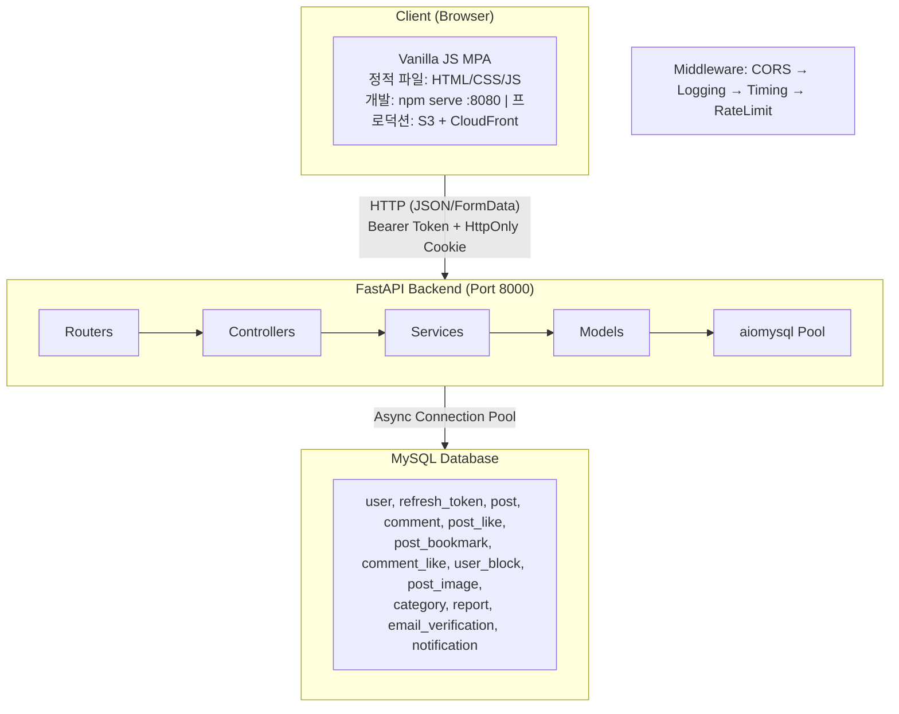
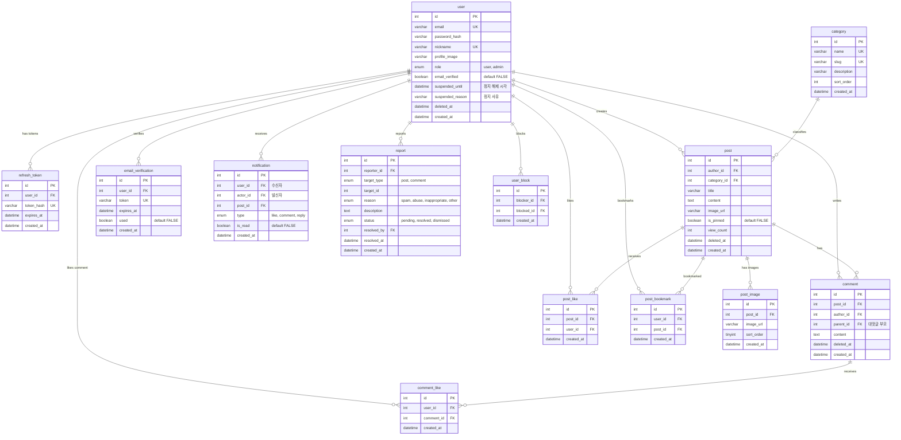
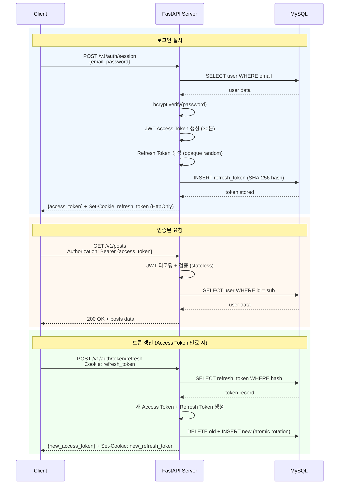

# 2-cho-community-fe

AWS AI School 2기 과제: 커뮤니티 프론트엔드

## 요약 (Summary)

커뮤니티 포럼 "아무 말 대잔치"를 구축합니다. FastAPI를 기반으로 하는 비동기 백엔드와 Vanilla JavaScript 프론트엔드(순수 정적 파일)로 구성된 모노레포 구조이며, JWT 기반 인증(Access Token + Refresh Token)과 MySQL 데이터베이스를 사용합니다. 게시글 CRUD, 댓글(대댓글 포함), 좋아요, 북마크, 댓글 좋아요, 공유, 다중 이미지, 사용자 차단, 검색/정렬(최신순·좋아요순·조회수순·댓글순·인기순), 이메일 인증, 실시간 알림(WebSocket + 폴링 폴백), 내 활동 조회, 사용자 프로필, 관리자 계정 정지/해제, 마크다운 에디터(GFM + 코드 구문 강조), 팔로우/팔로잉, 관리자 대시보드, 투표(Poll) 기능을 제공합니다.

**개발 환경**: 프론트엔드는 Vite 개발 서버(HMR)를 사용하며, Python 의존성이 없습니다. 프로덕션 빌드(`npm run build`)는 해시된 에셋을 생성하고, S3 + CloudFront로 배포됩니다.

## 배경 (Background)

AWS AI School 2기의 개인 프로젝트로 커뮤니티 서비스를 개발해야 합니다. 수강생들이 자유롭게 소통할 수 있는 공간이 필요하며, 실무에서 자주 사용되는 기술 스택(FastAPI, MySQL, Vanilla JS)을 학습하고 적용하는 것이 목표입니다.

기존에 별도의 커뮤니티 플랫폼이 없어 수강생 간 교류가 제한적이었습니다. 이 서비스를 통해 학습 경험을 공유하고, 질문/답변을 주고받으며, 프로젝트 협업의 기회를 마련하고자 합니다.

## 목표 (Goals)

- 회원가입, 로그인, 로그아웃, 회원 탈퇴 기능을 제공한다.
- 게시글 작성, 조회, 수정, 삭제(CRUD) 기능을 제공한다.
- 댓글 작성, 수정, 삭제 기능을 제공한다. (1단계 대댓글 지원)
- 게시글 검색(제목+내용) 및 정렬(최신순/좋아요순/조회수순/댓글순) 기능을 제공한다.
- 게시글 좋아요/좋아요 취소 기능을 제공한다.
- 프로필 이미지 및 닉네임 수정 기능을 제공한다.
- 무한 스크롤 기반의 게시글 목록을 제공한다.
- 모바일/데스크탑 반응형 UI를 제공한다.
- 이메일 인증 페이지를 제공한다. (토큰 기반 인증 결과 표시)
- 알림 페이지를 제공한다. (읽음/삭제 처리, 무한 스크롤, 헤더 뱃지 30초 폴링)
- 내 활동 페이지를 제공한다. (탭 UI: 내가 쓴 글/댓글/좋아요한 글)
- 타 사용자 프로필 페이지를 제공한다. (닉네임 클릭으로 프로필 이동, 작성 글 목록)
- 게시글 북마크/북마크 취소 기능을 제공한다. (낙관적 UI 업데이트)
- 댓글 좋아요/좋아요 취소 기능을 제공한다. (서버 리프레시 방식)
- 게시글 공유 기능을 제공한다. (모바일 Web Share API, 데스크톱 클립보드 복사)
- 다중 이미지 업로드를 지원한다. (게시글당 최대 5장, 갤러리 뷰)
- 사용자 차단/해제 기능을 제공한다. (차단된 사용자의 게시글/댓글 숨김)
- 인기순(Hot) 정렬을 제공한다. (좋아요·댓글·조회수 가중 + 시간 감쇠)
- 관리자 계정 정지/해제 기능을 제공한다. (사용자 프로필에서 기간+사유 입력, 신고 처리 시 연동)
- 정지된 사용자의 로그인 차단 및 정지 사유 안내를 제공한다.
- 마크다운 에디터를 제공한다. (GFM 문법, 코드 구문 강조, 툴바 + 미리보기)

## 목표가 아닌 것 (Non-Goals)

- 실시간 알림 기능 (WebSocket) — 현재는 30초 폴링 방식 사용
- 소셜 로그인 (OAuth)

## 계획 (Plan)

### 1. 시스템 아키텍처


```mermaid
flowchart TD
    subgraph Client["Client (Browser)"]
        FE["Vanilla JS MPA<br/>정적 파일: HTML/CSS/JS<br/>개발: npm serve :8080 | 프로덕션: S3 + CloudFront"]
    end

    Client -->|"HTTP (JSON/FormData)<br/>Bearer Token + HttpOnly Cookie"| Backend

    subgraph Backend["FastAPI Backend (Port 8000)"]
        direction LR
        Routers --> Controllers --> Services --> Models --> Pool["aiomysql Pool"]
    end

    note["Middleware: CORS → Logging → Timing → RateLimit"]

    Backend -->|"Async Connection Pool"| DB

    subgraph DB["MySQL Database"]
        Tables["user, refresh_token, post, comment, post_like,<br/>post_bookmark, comment_like, user_block, post_image,<br/>category, report, email_verification, notification"]
    end
```

### 2. 데이터베이스 설계

#### ERD


```mermaid
erDiagram
    user ||--o{ refresh_token : "has tokens"
    user ||--o{ post : "creates"
    user ||--o{ comment : "writes"
    user ||--o{ post_like : "likes"
    user ||--o{ email_verification : "verifies"
    user ||--o{ notification : "receives"
    user ||--o{ report : "reports"
    user ||--o{ post_bookmark : "bookmarks"
    user ||--o{ comment_like : "likes comment"
    user ||--o{ user_block : "blocks"
    post ||--o{ comment : "has"
    post ||--o{ post_like : "receives"
    post ||--o{ post_bookmark : "bookmarked"
    post ||--o{ post_image : "has images"
    comment ||--o{ comment_like : "receives"
    category ||--o{ post : "classifies"

    user {
        int id PK
        varchar email UK
        varchar password_hash
        varchar nickname UK
        varchar profile_image
        enum role "user, admin"
        boolean email_verified "default FALSE"
        datetime suspended_until "정지 해제 시각"
        varchar suspended_reason "정지 사유"
        datetime deleted_at
        datetime created_at
    }

    refresh_token {
        int id PK
        int user_id FK
        varchar token_hash UK
        datetime expires_at
        datetime created_at
    }

    post {
        int id PK
        int author_id FK
        int category_id FK
        varchar title
        text content
        varchar image_url
        boolean is_pinned "default FALSE"
        int view_count
        datetime deleted_at
        datetime created_at
    }

    category {
        int id PK
        varchar name UK
        varchar slug UK
        varchar description
        int sort_order
        datetime created_at
    }

    report {
        int id PK
        int reporter_id FK
        enum target_type "post, comment"
        int target_id
        enum reason "spam, abuse, inappropriate, other"
        text description
        enum status "pending, resolved, dismissed"
        int resolved_by FK
        datetime resolved_at
        datetime created_at
    }

    comment {
        int id PK
        int post_id FK
        int author_id FK
        int parent_id FK "대댓글 부모"
        text content
        datetime deleted_at
        datetime created_at
    }

    post_like {
        int id PK
        int post_id FK
        int user_id FK
        datetime created_at
    }

    email_verification {
        int id PK
        int user_id FK
        varchar token UK
        datetime expires_at
        boolean used "default FALSE"
        datetime created_at
    }

    notification {
        int id PK
        int user_id FK "수신자"
        int actor_id FK "발신자"
        int post_id FK
        enum type "like, comment, reply"
        boolean is_read "default FALSE"
        datetime created_at
    }

    post_bookmark {
        int id PK
        int user_id FK
        int post_id FK
        datetime created_at
    }

    comment_like {
        int id PK
        int user_id FK
        int comment_id FK
        datetime created_at
    }

    user_block {
        int id PK
        int blocker_id FK
        int blocked_id FK
        datetime created_at
    }

    post_image {
        int id PK
        int post_id FK
        varchar image_url
        tinyint sort_order
        datetime created_at
    }
```

#### 주요 설계 결정

- **Soft Delete**: `user`, `post`, `comment` 테이블에 `deleted_at` 컬럼 사용. 물리적 삭제 대신 논리적 삭제로 데이터 보존.
- **JWT 기반 인증**: Access Token(30분, HS256) + Refresh Token(7일, opaque random). Access Token은 프론트엔드 in-memory 저장, Refresh Token은 HttpOnly 쿠키 + SHA-256 해시 DB 저장. JWT payload에는 `sub`(user_id)만 포함하여 PII 노출 방지. 토큰 회전(rotation)으로 탈취 시 자동 무효화.
- **인덱스 전략**:
  - `idx_refresh_token_hash`: Refresh Token 해시 조회
  - `idx_post_created_deleted`: 최신순 게시글 목록 조회
  - `idx_comment_post_deleted`: 게시글별 댓글 목록 조회
  - `idx_notification_user_read`: 알림 목록 조회 (사용자별 + 읽음 상태)
  - `idx_email_verification_token`: 이메일 인증 토큰 조회
  - `idx_post_category`: 카테고리별 게시글 목록 조회
  - `idx_post_pinned`: 고정 게시글 우선 정렬
  - `idx_report_status`: 신고 상태별 목록 조회
  - `idx_post_bookmark_post_id`: 게시글별 북마크 수 집계
  - `idx_post_bookmark_user`: 사용자별 북마크 목록 (최신순)
  - `idx_comment_like_comment_id`: 댓글별 좋아요 수 집계
  - `idx_comment_like_user`: 사용자별 댓글 좋아요 목록
  - `idx_user_block_blocker`: 차단한 사용자 목록 조회
  - `idx_user_block_blocked`: 차단당한 사용자 역조회
  - `idx_post_image_post`: 게시글별 이미지 순서 조회

### 3. API 설계

#### 인증 API (`/v1/auth`)

| Method | Endpoint | 설명 | 인증 |
| ------ | -------- | ---- | ---- |
| POST | `/v1/auth/session` | 로그인 (Access Token + Refresh Token 발급) | X |
| DELETE | `/v1/auth/session` | 로그아웃 (Refresh Token 무효화) | O |
| POST | `/v1/auth/token/refresh` | 토큰 갱신 (Refresh Token → 새 Access Token) | X (쿠키) |
| GET | `/v1/auth/me` | 현재 사용자 정보 | O |

#### 사용자 API (`/v1/users`)

| Method | Endpoint | 설명 | 인증 |
| ------ | -------- | ---- | ---- |
| POST | `/v1/users` | 회원가입 | X |
| POST | `/v1/users/find-email` | 이메일 찾기 (닉네임 → 마스킹 이메일) | X |
| POST | `/v1/users/reset-password` | 비밀번호 재설정 (이메일 → 임시 비밀번호 발송) | X |
| GET | `/v1/users/{user_id}` | 사용자 프로필 조회 | X |
| PATCH | `/v1/users/me` | 프로필 수정 (본인) | O |
| DELETE | `/v1/users/me` | 회원 탈퇴 (본인) | O |
| PUT | `/v1/users/me/password` | 비밀번호 변경 | O |
| POST | `/v1/users/profile/image` | 프로필 이미지 업로드 | O |

#### 게시글 API (`/v1/posts`)

| Method | Endpoint | 설명 | 인증 |
| ------ | -------- | ---- | ---- |
| GET | `/v1/posts` | 게시글 목록 (페이지네이션, `?search=`, `?sort=latest\|likes\|views\|comments\|hot`, `?category_id=`) | X |
| POST | `/v1/posts` | 게시글 작성 (`category_id` 필수) | O (이메일 인증) |
| GET | `/v1/posts/{post_id}` | 게시글 상세 조회 | X |
| PATCH | `/v1/posts/{post_id}` | 게시글 수정 | O (작성자) |
| DELETE | `/v1/posts/{post_id}` | 게시글 삭제 | O (작성자/관리자) |
| PATCH | `/v1/posts/{post_id}/pin` | 게시글 고정 | O (관리자) |
| DELETE | `/v1/posts/{post_id}/pin` | 게시글 고정 해제 | O (관리자) |
| POST | `/v1/posts/{post_id}/likes` | 좋아요 | O |
| DELETE | `/v1/posts/{post_id}/likes` | 좋아요 취소 | O |
| POST | `/v1/posts/{post_id}/comments` | 댓글 작성 | O |
| PUT | `/v1/posts/{post_id}/comments/{comment_id}` | 댓글 수정 | O (작성자) |
| DELETE | `/v1/posts/{post_id}/comments/{comment_id}` | 댓글 삭제 | O (작성자/관리자) |
| POST | `/v1/posts/{post_id}/bookmark` | 북마크 추가 | O (이메일 인증) |
| DELETE | `/v1/posts/{post_id}/bookmark` | 북마크 해제 | O (이메일 인증) |
| POST | `/v1/posts/{post_id}/comments/{comment_id}/like` | 댓글 좋아요 | O (이메일 인증) |
| DELETE | `/v1/posts/{post_id}/comments/{comment_id}/like` | 댓글 좋아요 취소 | O (이메일 인증) |
| POST | `/v1/posts/image` | 게시글 이미지 업로드 | O |

#### 사용자 차단 API (`/v1/users`)

| Method | Endpoint | 설명 | 인증 |
| ------ | -------- | ---- | ---- |
| POST | `/v1/users/{user_id}/block` | 사용자 차단 | O (이메일 인증) |
| DELETE | `/v1/users/{user_id}/block` | 사용자 차단 해제 | O (이메일 인증) |
| GET | `/v1/users/me/blocks` | 차단 목록 조회 | O |
| GET | `/v1/users/me/bookmarks` | 북마크 목록 조회 | O |

#### 카테고리 API (`/v1/categories`)

| Method | Endpoint | 설명 | 인증 |
| ------ | -------- | ---- | ---- |
| GET | `/v1/categories` | 카테고리 목록 조회 | X |

#### 신고 API (`/v1/reports`, `/v1/admin/reports`)

| Method | Endpoint | 설명 | 인증 |
| ------ | -------- | ---- | ---- |
| POST | `/v1/reports` | 신고 생성 | O (이메일 인증) |
| GET | `/v1/admin/reports` | 신고 목록 조회 (`?status=pending\|resolved\|dismissed`) | O (관리자) |
| PATCH | `/v1/admin/reports/{report_id}` | 신고 처리 (resolved/dismissed, `suspend_days` 선택적 정지 연동) | O (관리자) |

#### 계정 정지 API (`/v1/admin/users`)

| Method | Endpoint | 설명 | 인증 |
| ------ | -------- | ---- | ---- |
| POST | `/v1/admin/users/{user_id}/suspend` | 사용자 정지 (`duration_days`, `reason`) | O (관리자) |
| DELETE | `/v1/admin/users/{user_id}/suspend` | 사용자 정지 해제 | O (관리자) |

#### 응답 형식

```json
{
  "code": 200,
  "message": "성공",
  "data": { },
  "errors": null,
  "timestamp": "2026-01-01T00:00:00Z"
}
```

#### 에러 코드

| HTTP Status | 설명 |
| ----------- | ---- |
| 400 | 잘못된 요청 (유효성 검사 실패) |
| 401 | 인증 필요 (토큰 만료/미로그인) |
| 403 | 권한 없음 (타인의 게시글 수정 시도 등) 또는 계정 정지 (`account_suspended`) |
| 404 | 리소스 없음 |
| 409 | 충돌 (이메일/닉네임 중복) |
| 500 | 서버 오류 |

### 4. 인증 흐름


```mermaid
sequenceDiagram
    participant Client
    participant Server as FastAPI Server
    participant MySQL

    rect rgb(240, 248, 255)
        Note over Client,MySQL: 로그인 절차
        Client->>Server: POST /v1/auth/session<br/>{email, password}
        Server->>MySQL: SELECT user WHERE email
        MySQL-->>Server: user data
        Server->>Server: bcrypt.verify(password)
        Server->>Server: JWT Access Token 생성 (30분)
        Server->>Server: Refresh Token 생성 (opaque random)
        Server->>MySQL: INSERT refresh_token (SHA-256 hash)
        MySQL-->>Server: token stored
        Server-->>Client: {access_token} + Set-Cookie: refresh_token (HttpOnly)
    end

    rect rgb(255, 248, 240)
        Note over Client,MySQL: 인증된 요청
        Client->>Server: GET /v1/posts<br/>Authorization: Bearer {access_token}
        Server->>Server: JWT 디코딩 + 검증 (stateless)
        Server->>MySQL: SELECT user WHERE id = sub
        MySQL-->>Server: user data
        Server-->>Client: 200 OK + posts data
    end

    rect rgb(240, 255, 240)
        Note over Client,MySQL: 토큰 갱신 (Access Token 만료 시)
        Client->>Server: POST /v1/auth/token/refresh<br/>Cookie: refresh_token
        Server->>MySQL: SELECT refresh_token WHERE hash
        MySQL-->>Server: token record
        Server->>Server: 새 Access Token + Refresh Token 생성
        Server->>MySQL: DELETE old + INSERT new (atomic rotation)
        Server-->>Client: {new_access_token} + Set-Cookie: new_refresh_token
    end
```

### 5. 프론트엔드 아키텍처

#### 디렉토리 구조

```text
2-cho-community-fe/
├── html/                    # 14개 정적 HTML 페이지
│   ├── post_list.html       # 메인 피드
│   ├── post_detail.html     # 게시글 상세
│   ├── post_write.html      # 게시글 작성
│   ├── post_edit.html       # 게시글 수정
│   ├── user_login.html      # 로그인
│   ├── user_signup.html     # 회원가입
│   ├── user_find_account.html # 계정 찾기 (이메일/비밀번호)
│   ├── user_password.html   # 비밀번호 변경
│   ├── user_edit.html       # 프로필 수정
│   ├── verify-email.html    # 이메일 인증
│   ├── notifications.html   # 알림
│   ├── my-activity.html     # 내 활동
│   ├── user-profile.html    # 타 사용자 프로필
│   └── admin-reports.html   # 관리자 신고 관리
│
├── js/
│   ├── app/                 # 페이지별 진입점
│   ├── controllers/         # 비즈니스 로직
│   ├── models/              # API 통신 계층
│   ├── views/               # DOM 렌더링
│   ├── components/          # 재사용 UI 컴포넌트 (MarkdownEditor)
│   ├── services/            # ApiService (HTTP 클라이언트)
│   ├── utils/               # Logger, Validators, Formatters, Markdown
│   ├── config.js            # API_BASE_URL
│   └── constants.js         # 엔드포인트, 메시지, 라우트
│
└── css/
    ├── style.css            # 마스터 import (@import 진입점)
    ├── variables.css         # 디자인 토큰 (60+ CSS Custom Properties)
    ├── base.css             # 리셋, 타이포그래피
    ├── layout.css           # 헤더, 컨테이너
    ├── modules/             # 재사용 컴포넌트 (버튼, 폼, 카드, 모달, 토스트)
    └── pages/               # 페이지별 스타일
```

#### MVC 패턴

- **Model**: API 호출 담당. `AuthModel`, `PostModel`, `UserModel`, `CommentModel`, `NotificationModel`, `ActivityModel`, `ReportModel`, `CategoryModel`
- **View**: DOM 렌더링. 정적 메서드로 HTML 생성 및 이벤트 바인딩
- **Controller**: 비즈니스 로직. Model과 View 조정, 상태 관리 (`MainController`, `DetailController`, `WriteController`, `NotificationController`, `MyActivityController`, `UserProfileController` 등)

#### 주요 패턴

- **정적 메서드**: 모든 클래스가 static 메서드만 사용
- **IntersectionObserver**: 무한 스크롤 구현
- **Custom Event**: `auth:session-expired` 이벤트로 401 처리 (silent refresh 실패 시 발생), `auth:account-suspended` 이벤트로 403 계정 정지 처리 (관리자 API 제외, 로그인 페이지로 리다이렉트)
- **XSS 방지**: `createElement()` / `textContent` 기반 DOM 생성. 마크다운 렌더링은 유일한 예외로 DOMPurify 라이브러리로 sanitize 후 삽입 (`renderMarkdown()`, `renderMarkdownTo()` 단일 진입점)
- **성능 최적화**:
  - **Lazy Loading**: `loading="lazy"` 속성으로 이미지 로딩 지연
  - **Debounce**: 입력 이벤트(회원가입 등) 제어로 불필요한 연산 방지
- **에러 처리**: `ErrorBoundary`를 통한 재시도 로직 및 에러 복구 전략
- **낙관적 UI (Optimistic UI)**: 좋아요/북마크 토글 시 API 응답 전에 즉시 UI 반영, 실패 시 롤백 (DetailController)
- **서버 리프레시**: 댓글 좋아요는 트리 구조 재구축 필요 → `_notifyChange()` → `_reloadComments()`로 댓글 목록 갱신
- **Web Share API**: 모바일 `navigator.share()` + 데스크톱 `navigator.clipboard.writeText()` 폴백
- **이미지 갤러리**: 다중 이미지(`image_urls[]`) 갤러리 렌더링, 단일 이미지(`image_url`) 하위 호환
- **비동기 응답 무효화**: 검색/정렬 변경 시 `loadGeneration` 카운터로 in-flight 응답 폐기
- **마크다운 렌더링**: `marked`(GFM 파싱) + `DOMPurify`(XSS 방지) + `highlight.js`(코드 구문 강조). 게시글 본문은 `renderMarkdownTo()`, 댓글은 `renderMarkdown()` + `<template>` 요소 패턴. `breaks: true` 설정으로 기존 플레인텍스트 호환
- **마크다운 에디터**: `MarkdownEditor` 컴포넌트가 textarea 래핑. 풀 모드(게시글: 14버튼 툴바) / 컴팩트 모드(댓글: 5버튼). 미리보기 토글, Ctrl+B/I 단축키 지원

### 6. 보안 고려사항

| 항목 | 구현 방식 |
| ---- | --------- |
| 비밀번호 해싱 | `bcrypt` (cost factor 12) |
| JWT 인증 | Access Token(30분, in-memory) + Refresh Token(7일, HttpOnly Cookie, SHA-256 해시 DB 저장) |
| CORS | 허용 출처 명시적 설정 (`localhost:8080`) |
| SQL Injection | Parameterized queries (`aiomysql`) |
| XSS | `createElement()` / `textContent` 기반 DOM 생성. 마크다운 렌더링만 DOMPurify sanitize 후 innerHTML 사용 |
| Timing Attack | 로그인 시 존재하지 않는 사용자도 `bcrypt` 검증 수행 |

### 7. 비밀번호 정책

- 길이: 8-20자
- 필수 포함: 대문자, 소문자, 숫자, 특수문자

## 이외 고려 사항들 (Other Considerations)

- **JWT 인증**: Access Token(HS256, 30분) + Refresh Token(opaque random, 7일) 이중 토큰 전략 사용. Access Token은 프론트엔드 in-memory(JS 변수)에 저장하여 XSS 노출 최소화, Refresh Token은 HttpOnly 쿠키로 전달하고 SHA-256 해시로 DB에 저장. 토큰 회전(rotation)을 통해 Refresh Token 탈취 시 자동 무효화. CSRF 미들웨어는 제거됨 (Bearer 토큰이 CSRF 방어 역할).
- **ORM vs Raw SQL**: SQLAlchemy 등 ORM 사용을 고려했으나, 학습 목적으로 raw SQL을 직접 작성하여 쿼리 최적화 경험을 쌓기로 결정.
- **Vanilla JS**: React, Vue 등 프레임워크 대신 Vanilla JS를 선택. 프레임워크 학습 비용 없이 JavaScript 기본기를 다지는 것이 목표.
- **이미지 저장소**: 프로덕션에서는 EFS(`/mnt/uploads`)에 저장. 로컬 개발 시에도 로컬 파일시스템 사용.
- **Soft Delete**: 물리적 삭제 대신 `deleted_at` 컬럼 사용. 데이터 복구 가능성 확보 및 FK 무결성 유지.

## 마일스톤 (Milestones)

| 단계 | 기간 | 내용 |
| ---- | ---- | ---- |
| 1단계 | 1주차 | DB 스키마 설계, 백엔드 프로젝트 셋업, 인증 API 구현 |
| 2단계 | 2주차 | 게시글/댓글/좋아요 API 구현, 이미지 업로드 |
| 3단계 | 3주차 | 프론트엔드 구현 (HTML/CSS/JS), API 연동 |
| 4단계 | 4주차 | E2E 테스트 작성, QA, 버그 수정 |
| 5단계 | 5주차 | 문서화, 코드 리뷰, 최종 배포 |

## Changelog

### 2026-03 (Mar)

- **03-09: Quick Wins — 팔로잉 피드 + 연관 게시글 UI**
  - 팔로잉 피드: 게시글 목록에 "팔로잉" 토글 버튼 (로그인 시만 표시, 기존 정렬과 조합 가능)
  - 연관 게시글: 상세 페이지에 관련 게시글 섹션 (태그/카테고리 기반, lazy load, 0건이면 숨김)
  - 팔로잉 빈 상태 메시지: "팔로우한 사용자의 게시글이 여기에 표시됩니다."

- **03-06: 투표 생성/참여 UI**
  - 게시글 작성 시 "투표 추가" 토글 — 질문, 동적 옵션(2~10개), 만료일 입력
  - 게시글 상세: 미투표 시 라디오 버튼 + 투표 버튼, 투표 후 수평 바 차트 결과
  - 만료된 투표는 결과만 표시, 총 투표수 + 만료일 정보

- **03-06: 관리자 대시보드 페이지**
  - `/admin/dashboard` 신규 페이지 (비관리자 리다이렉트)
  - 요약 통계 카드 (총 사용자/게시글/댓글/오늘 가입자)
  - 30일 일별 통계 테이블, 사용자 관리 (검색 + 무한 스크롤 + 정지/해제)

- **03-06: 팔로우/팔로잉 UI**
  - 타 사용자 프로필에 팔로우/언팔로우 버튼 (본인 프로필 숨김)
  - 프로필 stats에 팔로워/팔로잉 수 표시
  - 알림 페이지에서 팔로우 알림 타입 (새 게시글 작성 알림) 렌더링

- **03-04: 마크다운 에디터**
  - 렌더링: `marked`(GFM) + `DOMPurify`(XSS 방지) + `highlight.js`(구문 강조 9언어)
  - 에디터: `MarkdownEditor` 컴포넌트 — 풀 모드(게시글, 14버튼 툴바) / 컴팩트 모드(댓글, 5버튼)
  - 미리보기 토글, Ctrl+B/I 단축키, `breaks: true` 기존 플레인텍스트 호환
  - CSS: 코드 하이라이팅 15 토큰 + 다크 모드 대응, `markdown.css` 신규

- **03-04: 프론트엔드 계정 정지 UI**
  - 로그인 차단: 정지된 사용자 로그인 시 403 → 해제 예정일 + 사유 인라인 표시
  - 글로벌 정지 감지: `ApiService` 403 `account_suspended` → `auth:account-suspended` 이벤트 → 로그인 페이지 리다이렉트 (관리자 API 제외)
  - 관리자 프로필 정지: 타 사용자 프로필에서 기간(일) + 사유 입력 모달, 정지/해제 토글
  - 신고 처리 연동: 관리자 신고 처리 시 체크박스로 작성자 동시 정지 (`suspend_days`)
  - 정지 배지: 정지된 사용자 프로필에 "정지 중 (날짜까지)" 배지 표시

- **03-04: Vite 빌드 시스템 도입**
  - `vite.config.js` 신규: 14개 HTML MPA 엔트리포인트 + 클린 URL 리라이트 플러그인
  - `package.json` 스크립트 전환: `serve` → `vite` (dev/build/preview)
  - Dockerfile 멀티 스테이지 빌드: `node:20-alpine` → `nginx:alpine`
  - `nginx.conf`에 `/assets/` 장기 캐싱 규칙 추가 (해시된 에셋, 1년 만료)
  - CD 워크플로우: Node.js 빌드 스텝 + `dist/` S3 sync

- **03-03: CSS 디자인 토큰 시스템 (Design System Cleanup Stage 1)**
  - `css/variables.css` 신규: 60+ 디자인 토큰 (색상, 타이포그래피, 간격, 반경, 그림자, z-index, 트랜지션)
  - 21개 CSS 파일 하드코딩 값 → `var()` 참조 전환 (200+ 교체)
  - `helpers.js` 내 하드코딩 색상 → CSS 변수 참조로 변경
  - 토스트 시스템 통합: `modals.css` 중복 `.toast` 제거 → `toast.css`의 `#toast` 단일 시스템

- **03-02: 핵심 커뮤니티 기능 (북마크, 댓글 좋아요, 공유, 다중 이미지, 사용자 차단, 인기 게시글)**
  - 북마크: 게시글 상세 stat-box + 낙관적 UI 토글, 내 활동 > 북마크 탭 추가
  - 댓글 좋아요: 댓글/대댓글 ♡ 버튼 + 카운트, 서버 리프레시 방식 (트리 재구축)
  - 공유: 모바일 Web Share API + 데스크톱 클립보드 복사, 토스트 피드백
  - 다중 이미지: 게시글 작성/수정 시 최대 5장 업로드, 상세 갤러리 뷰, `image_url` 하위 호환
  - 사용자 차단: 게시글 상세 차단/해제 버튼, 차단된 사용자 게시글·댓글 숨김
  - 인기순 정렬: "핫" 정렬 옵션 추가 (좋아요×3 + 댓글×2 + 조회수×0.5, 시간 감쇠)
  - 카드 UI 확장: 북마크 카운트 표시, 정렬 버튼에 "핫" 추가

- **03-02: 관리자 역할, 신고, 카테고리, 게시글 고정 UI**
  - 카테고리 탭: 게시글 목록 상단 가로 스크롤 탭, 카테고리별 필터링
  - 게시글 작성/수정: 카테고리 select 드롭다운, 공지사항은 관리자만 선택 가능
  - 신고: 게시글/댓글 신고 버튼, 사유 선택 모달 (4종: 스팸/욕설/부적절/기타)
  - 관리자 기능: 타인 게시글/댓글 삭제, 고정/해제, 신고 관리 페이지 (`/admin/reports`)
  - 고정 배지 + 카테고리 배지 UI, 드롭다운에 관리자 메뉴

- **03-02: 이메일 인증, 알림, 내 활동, 사용자 프로필 UI**
  - 이메일 인증 페이지: 토큰 검증 결과 표시, 성공 시 로그인 페이지 리다이렉트
  - 알림 페이지: 무한 스크롤 목록, 읽음/삭제 처리, 헤더 벨 아이콘 + 뱃지 (30초 폴링)
  - 내 활동 페이지: 탭 UI (내가 쓴 글/댓글/좋아요한 글), 탭별 무한 스크롤
  - 사용자 프로필: 공개 프로필 + 작성 글 목록, 닉네임 클릭으로 이동 (게시글 목록/상세/댓글)
  - 헤더 드롭다운에 "내 활동" 메뉴 추가, `PostModel.getPosts()`에 `authorId` 필터 추가

- **03-08: 실시간 알림 (WebSocket)**
  - `js/services/WebSocketService.js`: 연결 생명주기 싱글턴 (인증, 지수 백오프 재연결, heartbeat)
  - `HeaderController.js`: WebSocket 우선 연결, 실패 시 기존 ETag 폴링 자동 폴백
  - `config.js`: `WS_BASE_URL` 추가 (로컬 `ws://`, 프로덕션 `wss://`)
  - 실시간 알림 수신 → 즉시 뱃지 업데이트 + 토스트 표시

### 2026-02 (Feb)

- **02-28: 뒤로가기 버튼 UI 통일**
  - `user_signup.html`: `<a>` 텍스트 `<` → `<button>` SVG chevron 통일 (기존 JS 바인딩 미작동 수정)
  - `user_find_account.html`: 누락된 뒤로가기 버튼 추가

- **02-28: 계정 찾기 페이지 (이메일 찾기 + 비밀번호 재설정)**
  - `user_find_account.html`: 탭 UI (이메일 찾기 / 비밀번호 찾기)
  - 이메일 찾기: 닉네임 입력 → 마스킹 이메일 결과 표시
  - 비밀번호 재설정: 이메일 입력 → 임시 비밀번호 발송 토스트
  - MVC 패턴: `FindAccountController` + `FindAccountView`, 429 Rate Limit 처리

- **02-28: 전체 코드 리뷰 기반 버그 수정**
  - Silent refresh: 401 시 토큰 갱신 후 원래 요청 자동 재시도 (`_isRetry` 플래그로 무한 루프 방지)
  - 이미지 미리보기: `post_write.html`, `post_edit.html`에 누락된 `#image-preview` 요소 추가
  - Detail 페이지 이중 인증 요청 제거 (HeaderController에서 유저 전달)
  - Dead code 정리: `escapeHtml()`, `CommentModel.getComments()`, `FormValidator.updateButtonState()` 제거

- **02-27: GitHub Actions CD 파이프라인 구축**
  - `deploy-frontend.yml`: `workflow_dispatch` → Vite build (`npm ci && npm run build`) → `dist/` S3 sync → CloudFront invalidation
  - OIDC 인증 (GitHub → AWS IAM Role), 환경 선택 (dev/staging/prod)
  - Vite 빌드 결과(`dist/`)를 S3에 동기화, 해시된 에셋으로 CDN 장기 캐싱

- **02-25: JWT 인증 전환**
  - 세션 기반 → JWT (Access Token 30분 + Refresh Token 7일)
  - `ApiService.js`: Bearer 토큰 관리, silent refresh, thundering herd 보호
  - CSRF 관련 코드 완전 제거 (Bearer 토큰이 CSRF 방어 역할)

- **02-09 ~ 12: 보안 강화 + 개발 환경 개선**
  - XSS 정책 100% 준수: innerHTML 완전 제거, `escapeCssUrl` 전면 적용, URL sanitization
  - CSRF Double Submit Cookie 구현 (이후 JWT 전환으로 제거)
  - Python 의존성 제거, `npm serve` 마이그레이션 (Port 8080)

- **02-02 ~ 06: 코드 품질 + 성능**
  - `ErrorBoundary` 도입 (지수 백오프 재시도, GET 자동 재시도)
  - 애니메이션 모듈 (스켈레톤, 스피너, 토스트, 좋아요 heartPop)
  - Lazy Loading, debounce, 댓글 부분 업데이트
  - 코드 리팩토링: `NAV_PATHS`/`UI_MESSAGES` 상수 통합, 중복 제거

### 2026-01 (Jan)

- **01-28 ~ 30: 안정화 + UX**
  - MVC 패턴 강화, 이미지 표시 버그 수정
  - 회원탈퇴 모달, 토스트 알림 (`alert()` 제거)
  - 무한 스크롤 버그 수정, 401 리다이렉션

- **01-21 ~ 25: 초기 구현**
  - 전체 페이지 구현 (로그인, 회원가입, 메인, 상세, 작성, 수정, 프로필, 비밀번호)
  - MVC 패턴 도입 (Model/View/Controller 분리)
  - 무한 스크롤, 좋아요, 댓글 CRUD, 이미지 업로드
